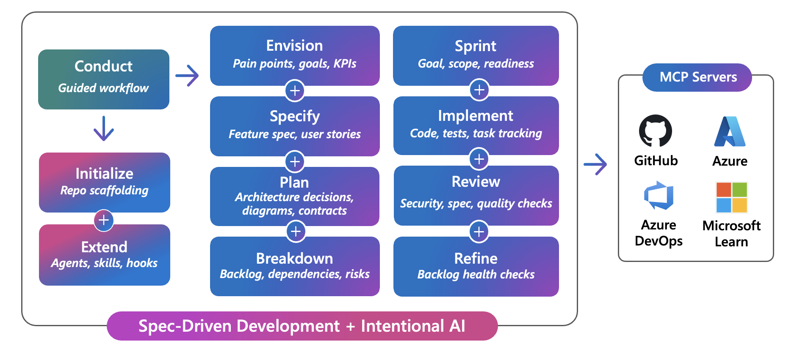

# DevSquad Delivery Framework

A GitHub Copilot delivery framework with guardrails to make AI-assisted development consistent, traceable, and maintainable.

## What You Get

This plugin adds **13 invocable agents**, **13 skills**, and **lifecycle hooks** that guide your team from product vision through implementation and review.

## Quick Start

Open Copilot Chat and select `devsquad` agent to start a guided session. The agent asks clarifying questions, delegates to specialized sub-agents, and maintains context across phases.

You can also invoke a specific agent directly:

| You have... | Start with | Try saying |
|-------------|-----------|------------|
| A product idea without defined scope | `devsquad.envision` | "We need a customer portal for order tracking" |
| A clear vision, ready to structure the backlog | `devsquad.kickoff` | "Structure the backlog from our business vision doc" |
| A defined feature to specify | `devsquad.specify` | "Write a spec for the user authentication feature" |
| A spec ready for technical planning | `devsquad.plan` | "What alternatives should we consider for state management in this workflow?" |
| Tasks ready to implement | `devsquad.implement` | "Implement task # 123" |
| An existing backlog that needs organization | `devsquad.refine` | "Analyze the backlog health and flag issues" |
| A plan ready to break into tasks | `devsquad.decompose` | "Decompose the auth spec into work items" |
| A sprint to plan | `devsquad.sprint` | "Prepare sprint 4 planning" |
| Security concerns on design or code | `devsquad.security` | "Run a security review on the payment module" |
| A completed implementation to validate | `devsquad.review` | "Review the code against the spec and plan" |

### Skills

Skills are reusable knowledge packages that agents load automatically when relevant. They are not invoked directly; instead, agents use them behind the scenes to enforce conventions and best practices.

| Skill | What it does |
|-------|-------------|
| `adr-workflow` | Creates and manages Architecture Decision Records with duplicate checking and completeness validation |
| `board-config` | Detects and configures the work item platform (GitHub Issues or Azure DevOps) |
| `complexity-analysis` | Estimates effort and analyzes complexity of user stories |
| `documentation-style` | Enforces formatting and style rules for markdown documentation |
| `engineering-practices` | Guides DevOps, CI/CD, branch strategy, and observability decisions |
| `git-branch` | Manages branch creation and strategy verification |
| `git-commit` | Creates standardized commits following Conventional Commits |
| `next-task` | Suggests the next task after completing an implementation |
| `pull-request` | Finalizes implementation with PR creation, automated review, and technical debt tracking |
| `quality-gate` | Validates quality of specs, ADRs, tasks, and code before delivery |
| `reasoning` | Records decisions and passes structured context between agents |
| `work-item-creation` | Creates work items on GitHub Issues or Azure DevOps with standardized checklists |
| `work-item-workflow` | Verifies assignee, dependencies, and priority when starting work on an item |

## Extensibility

Want to adapt the framework to your stack, domain, or team conventions? Use `devsquad.extend` to guide you to create:

- **Skills**: reusable knowledge packages that agents load on demand (e.g., coding standards, review checklists, domain rules)
- **Agents**: specialized workflows for tasks not covered by the built-in set (e.g., a migration agent, a data pipeline agent)
- **Hooks**: lifecycle scripts that run on session start, after tool use, or on session end (e.g., custom linters, policy checks)
- **Instructions**: path-scoped rules applied automatically when editing matching files (e.g., spec formatting, ADR conventions)

Extensions live in the project repository and are picked up automatically. See the [extensibility guide](https://github.com/microsoft/devsquad-copilot/blob/main/docs/framework/extensibility.md) for details.

## Prerequisites

- Node.js 18+ (for lint hooks and MCP servers)
- VS Code 1.111.0+ with the [GitHub Copilot Chat](https://marketplace.visualstudio.com/items?itemName=GitHub.copilot-chat) extension

For the full framework documentation, visit the [repository](https://github.com/microsoft/devsquad-copilot).

## License

[MIT](https://github.com/microsoft/devsquad-copilot/blob/main/LICENSE)
