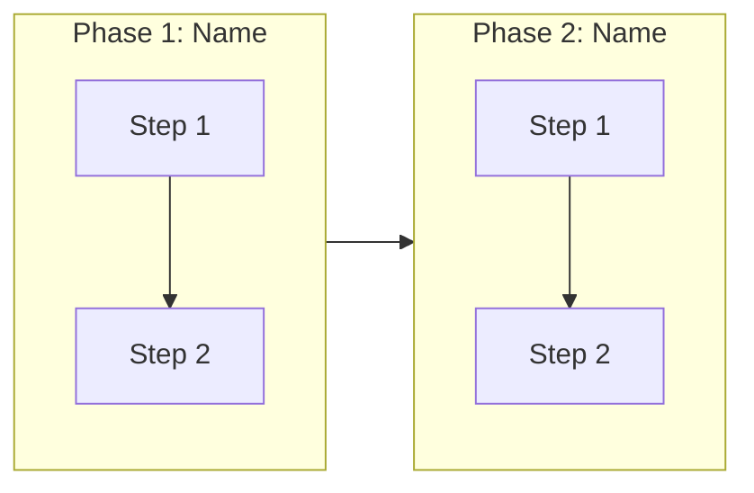

## Templates

### FILE: docs/features/TEMPLATE.md

```markdown

# Feature Specification: [FEATURE_NAME]

**Created on**: [DATE]  
**Status**: Draft  

## Executive Summary

<!--
  Condensation of the spec into 3-5 key points.
  Serves as a quick reference for the agent and developers.
  Update whenever the spec changes significantly.
-->

- **Objective**: [One sentence describing what the feature does]
- **Primary user**: [Who uses it]
- **Value delivered**: [Why it matters]
- **Scope**: [What is included / excluded]
- **Primary success criterion**: [Most important metric]

## Non-Scope *(required)*

<!--
  Explicitly declare what is NOT part of this feature.
  Protects the scope against implicit expansion and aligns expectations.
  Minimum 1 item.
-->

- [What is out of scope and reason for exclusion]

## Assumptions

<!--
  Document reasonable defaults assumed during specification.
  Example: "Session-based authentication (web standard, no explicit requirement)"
-->

- [Assumption and basis for making it]

## User Scenarios & Tests *(required)*

<!--
  IMPORTANT: User stories must be PRIORITIZED as user journeys ordered by importance.
  Each user story/journey must be INDEPENDENTLY TESTABLE - meaning that if you implement only ONE of them,
  you will still have an MVP (Minimum Viable Product) that delivers value.
  
  Assign priorities (P1, P2, P3, etc.) to each story, where P1 is the most critical.
  Think of each story as an independent slice of functionality that can be:
  - Developed independently
  - Tested independently
  - Deployed independently
  - Demonstrated to users independently
-->

### User Story 1 - [Brief Title] (Priority: P1)

[Describe this user journey in simple language]

**Why this priority**: [Explain the value and why it has this priority level]

**Independent Test**: [Describe how this can be tested independently - e.g.: "Can be fully tested by [specific action] and delivers [specific value]"]

**Acceptance Scenarios**:

1. **Given** [initial state], **When** [action], **Then** [expected result]
2. **Given** [initial state], **When** [action], **Then** [expected result]

---

### User Story 2 - [Brief Title] (Priority: P2)

[Describe this user journey in simple language]

**Why this priority**: [Explain the value and why it has this priority level]

**Independent Test**: [Describe how this can be tested independently]

**Acceptance Scenarios**:

1. **Given** [initial state], **When** [action], **Then** [expected result]

---

### User Story 3 - [Brief Title] (Priority: P3)

[Describe this user journey in simple language]

**Why this priority**: [Explain the value and why it has this priority level]

**Independent Test**: [Describe how this can be tested independently]

**Acceptance Scenarios**:

1. **Given** [initial state], **When** [action], **Then** [expected result]

---

[Add more user stories as needed, each with an assigned priority]

### Edge Cases

<!--
  ACTION REQUIRED: The content of this section represents placeholders.
  Fill them in with the correct edge cases.
-->

- What happens when [boundary condition]?
- How does the system handle [error scenario]?

## Requirements *(required)*

<!--
  ACTION REQUIRED: The content of this section represents placeholders.
  Fill them in with the correct functional requirements.
-->

### Functional Requirements

- **FR-001**: The system MUST [specific capability, e.g.: "allow users to create accounts"]
- **FR-002**: The system MUST [specific capability, e.g.: "validate email addresses"]  
- **FR-003**: Users MUST be able to [key interaction, e.g.: "reset their password"]
- **FR-004**: The system MUST [data requirement, e.g.: "persist user preferences"]
- **FR-005**: The system MUST [behavior, e.g.: "log all security events"]

*Example of marking unclear requirements:*

- **FR-006**: The system MUST authenticate users via [NEEDS CLARIFICATION: authentication method not specified - email/password, SSO, OAuth?]
- **FR-007**: The system MUST retain user data for [NEEDS CLARIFICATION: retention period not specified]

### Key Entities *(include if the feature involves data)*

- **[Entity 1]**: [What it represents, key attributes without implementation]
- **[Entity 2]**: [What it represents, relationships with other entities]

## Success Criteria *(required)*

<!--
  ACTION REQUIRED: Define measurable success criteria.
  These must be technology-independent and measurable.
-->

### Measurable Outcomes

- **SC-001**: [Measurable metric, e.g.: "Users can complete account creation in less than 2 minutes"]
- **SC-002**: [Measurable metric, e.g.: "System supports 1000 concurrent users without degradation"]
- **SC-003**: [User satisfaction metric, e.g.: "90% of users successfully complete the main task on the first attempt"]
- **SC-004**: [Business metric, e.g.: "Reduce support tickets related to [X] by 50%"]

## Compliance Criteria *(required)*

<!--
  Acceptance tests derived directly from the spec.
  Any implementation must pass all these criteria.
  Format: Input → Expected Output (technology-independent).
-->

### Compliance Cases

| ID | Scenario | Input | Expected Output |
|----|----------|-------|-----------------|
| CC-001 | [Main happy path scenario] | [Valid input data] | [Expected result] |
| CC-002 | [Error scenario] | [Invalid or incomplete data] | [Error message or behavior] |
| CC-003 | [Edge case] | [Boundary or extreme condition] | [Expected behavior] |

<!--
  These criteria serve as a contract between spec and implementation.
  The agent must verify the implementation against these cases.
-->

## Related Specs

<!--
  Bidirectional links to related specifications.
  Migration specs that affect or depend on this feature.
  Other feature specs with shared dependencies.
-->

- [MS-001: Migration name](../migrations/<short-name>/spec.md) - [Relationship description]
- [FS-001: Feature name](../features/<short-name>/spec.md) - [Relationship description]
```

### END FILE

---

### FILE: docs/migrations/TEMPLATE.md

<!-- SYNC: Content must be identical to docs/templates/migration-spec.md -->

```markdown

# Migration Specification: [SYSTEM_NAME]

**Created on**: [DATE]
**Status**: Draft
**Type**: [Lift-and-Shift | Rehost | Replatform-Lite]

## Executive Summary

<!--
  Condensation of the migration scope into key decision points.
  Serves as a quick reference for agents and developers.
  Update whenever the spec changes significantly.
-->

- **Objective**: [One sentence describing what is being migrated and why]
- **Source environment**: [Where the system currently runs]
- **Target environment**: [Where the system will run after migration]
- **Scope**: [Systems and components included in this migration]
- **Downtime target**: [Zero-downtime | Planned maintenance window of X | Maximum X minutes]
- **Primary success criterion**: [Most important metric, e.g., "Zero data loss with less than 5 minutes downtime"]

## Out of Scope *(required)*

<!--
  Explicitly declare what is NOT part of this migration.
  Critical for preventing accidental modernization, which is the most common failure mode in lift-and-shift.
  Minimum 1 item.
-->

- [What is excluded and reason for exclusion]

## Assumptions

<!--
  Document infrastructure and environment assumptions.
  Examples:
  - "Network latency between source and target is equivalent to current on-prem latency"
  - "Same database engine and version available in target environment"
  - "No changes to authentication mechanism during migration"
-->

- [Assumption and basis for assuming it]

## System Mapping *(required)*

<!--
  Component-level mapping from source to target environment.
  Every component in scope must appear here.
  This is the primary input for IaC generation.
-->

| Component | Source | Target | Migration Notes |
|-----------|--------|--------|-----------------|
| [API Service] | [VM (Linux, Ubuntu 22.04)] | [Azure VM / AKS] | [Containerized or direct rehost] |
| [Database] | [SQL Server 2019] | [Azure SQL Managed Instance] | [Backup/restore compatible] |
| [Message Queue] | [RabbitMQ 3.12] | [Azure Service Bus] | [Protocol mapping required] |
| [Storage] | [NFS mount] | [Azure Blob Storage] | [Path remapping needed] |

## Environment Parity *(required)*

<!--
  Explicit constraints on environment equivalence.
  The target environment must satisfy all listed parity requirements.
  Deviations must be documented with justification and risk assessment.
-->

- **Runtime versions**: [List specific versions that MUST match, e.g., ".NET 8.0.x", "Node.js 20.x"]
- **OS versions**: [e.g., "Ubuntu 22.04 LTS or equivalent"]
- **Database versions**: [e.g., "SQL Server 2019 compatibility level 150"]
- **Configuration equivalence**: [e.g., "All environment variables and config files must produce identical runtime behavior"]
- **Dependencies**: [e.g., "All third-party packages at same major version"]
- **Deviations**: [Any known parity gaps with justification]

## Migration Scenarios & Tests *(required)*

<!--
  Testable migration sequences replacing user stories.
  Each scenario represents a critical migration phase that must be validated.
  Assign phase numbers (P1 = must complete first, P2 = depends on P1, etc.).
  Unlike feature stories, these are typically sequential, not independently deployable.
-->

### Migration Scenario 1 - [Brief Title] (Phase: P1)

[Describe this migration phase in plain language]

**Why this phase**: [Explain the dependency order and criticality]

**Validation**: [How to verify this phase completed successfully]

**Acceptance Scenarios**:

1. **Given** [initial state], **When** [migration action], **Then** [expected result]
2. **Given** [initial state], **When** [migration action], **Then** [expected result]

---

### Migration Scenario 2 - [Brief Title] (Phase: P2)

[Describe this migration phase in plain language]

**Why this phase**: [Explain the dependency order and criticality]

**Validation**: [How to verify this phase completed successfully]

**Acceptance Scenarios**:

1. **Given** [initial state], **When** [migration action], **Then** [expected result]

---

### Migration Scenario 3 - [Brief Title] (Phase: P3)

[Describe this migration phase in plain language]

**Why this phase**: [Explain the dependency order and criticality]

**Validation**: [How to verify this phase completed successfully]

**Acceptance Scenarios**:

1. **Given** [initial state], **When** [migration action], **Then** [expected result]

---

[Add more scenarios as needed, maintaining phase dependency order]

### Risk Scenarios

<!--
  Failure modes and recovery paths that must be tested.
  Minimum 2: one data-related, one infrastructure-related.
-->

- What happens when [data sync fails mid-transfer]?
- What happens when [target environment becomes unreachable during cutover]?
- How does the system handle [rollback after partial traffic switch]?

## Migration Strategy *(required)*

<!--
  High-level approach for executing the migration.
  This section informs the plan agent's artifact generation (IaC, scripts, pipelines).
-->

- **Migration approach**: [Backup/restore | CDC (Change Data Capture) | Dual-write | Snapshot + replay]
- **Deployment model**: [Blue/green | Parallel run | In-place cutover]
- **Traffic switch mechanism**: [DNS switch | Load balancer reconfiguration | Feature flag | Application-level routing]
- **Sync strategy**: [One-shot | Initial bulk + incremental delta | Continuous replication]

## Data Migration *(required)*

<!--
  Detailed data migration plan.
  This is the core of lift-and-shift. Incomplete data specs are the primary cause of migration failures.
-->

- **Data volume**: [Estimated total size across all data stores]
- **Sync strategy**: [Initial bulk load + delta sync | One-shot during maintenance window]
- **Delta handling**: [How changes during migration window are captured and applied]
- **Validation rules**:
  - Row counts must match between source and target
  - Checksum validation on critical tables: [list tables]
  - Referential integrity verified post-migration
  - [Additional domain-specific validation rules]
- **Data freeze**: [When and how write operations are frozen before cutover]

## Cutover Plan *(required)*

<!--
  Ordered steps for the actual migration execution.
  Each step must have a clear owner, duration estimate, and success criterion.
  The plan agent uses this to generate deployment pipelines.
-->

1. **Pre-cutover validation**: [Verify target environment readiness]
2. **Initial data sync**: [Bulk data transfer]
3. **Delta sync**: [Catch-up replication]
4. **Write freeze**: [Stop writes on source system]
5. **Final delta sync**: [Apply remaining changes]
6. **Data validation**: [Row counts, checksums, integrity checks]
7. **Traffic switch**: [Execute DNS/LB change]
8. **Post-cutover monitoring**: [Verify system health for X minutes]
9. **Declare success or rollback**: [Decision criteria]

## Rollback Plan *(required)*

<!--
  Steps to revert to the source environment if migration fails.
  Must be tested before the actual cutover.
-->

- **Rollback trigger**: [Conditions that trigger rollback, e.g., "data validation failure", "error rate above X%"]
- **Rollback steps**:
  1. [Revert traffic to source system]
  2. [Resume writes on source]
  3. [Verify source system operational]
  4. [Assess and preserve any data written to target during cutover]
- **Maximum rollback time**: [X minutes from decision to full revert]
- **Rollback tested**: [Yes/No, date of last test]

## Requirements *(required)*

### Functional Requirements

<!--
  System behavior requirements that must hold post-migration.
  Focus on parity: the system MUST behave identically to the source.
-->

- **FR-001**: The system MUST [behavioral parity requirement, e.g., "return identical API responses for all existing endpoints"]
- **FR-002**: The system MUST [data requirement, e.g., "preserve all historical data with no record loss"]
- **FR-003**: The system MUST [integration requirement, e.g., "maintain all existing external integrations"]

### Non-Functional Requirements *(required)*

<!--
  Performance, reliability, and operational requirements for the target environment.
  These define acceptable deviation from source environment behavior.
-->

- **NFR-001**: [Latency parity, e.g., "API response latency must not increase by more than 10% compared to source baseline"]
- **NFR-002**: [Throughput, e.g., "System must handle X requests per second (matching current production peak)"]
- **NFR-003**: [Availability, e.g., "99.9% uptime SLA post-migration"]
- **NFR-004**: [Error rate, e.g., "Error rate must not exceed current baseline of X%"]

## Success Criteria *(required)*

<!--
  Measurable outcomes that define migration success.
  These should be verifiable by automated checks where possible.
-->

### Measurable Outcomes

- **SC-001**: [Data integrity, e.g., "Zero data loss: 100% row count and checksum match between source and target"]
- **SC-002**: [Downtime, e.g., "Total downtime during cutover is less than X minutes"]
- **SC-003**: [Parity, e.g., "100% API response parity validated against baseline test suite"]
- **SC-004**: [Rollback, e.g., "Rollback completes successfully within X minutes in pre-cutover test"]
- **SC-005**: [Operational, e.g., "Monitoring and alerting operational within X minutes of cutover"]

## Conformance Criteria *(required)*

<!--
  Acceptance tests derived directly from the spec.
  Any implementation must pass all these criteria.
  Format: Input/Condition -> Expected Output (technology-independent).
  Minimum 3 cases: parity validation, failure/rollback, edge case.
-->

### Conformance Cases

| ID | Scenario | Input / Condition | Expected Output |
|----|----------|-------------------|-----------------|
| CC-001 | [Data parity after full sync] | [Query: SELECT COUNT(*) on all tables] | [Identical counts on source and target] |
| CC-002 | [API parity post-cutover] | [Replay baseline request set against target] | [Identical response bodies and status codes] |
| CC-003 | [Rollback execution] | [Trigger rollback during cutover] | [Source system fully operational within X minutes] |
| CC-004 | [Partial failure recovery] | [Network interruption during delta sync] | [Sync resumes from last checkpoint, no data corruption] |

<!--
  These criteria serve as a contract between spec and implementation.
  The agent must verify the implementation against these cases.
-->

## Related Specs

<!--
  Bidirectional links to related specifications.
  Feature specs that depend on or are affected by this migration.
  Other migration specs for related systems.
-->

- [FS-001: Feature name](../features/<short-name>/spec.md) - [Relationship description]
- [MS-001: Migration name](../migrations/<short-name>/spec.md) - [Relationship description]
```

### END FILE

---

### FILE: docs/envisioning/TEMPLATE.md

```markdown
# Envisioning: [Project/Product Name]

> **Status:** [In Discovery / In Validation / Approved]  
> **Last updated:** [YYYY-MM-DD]  
> **Version:** 1.0

---

## 1. Client Context

### 1.1 Direct Client

The team or organization we are serving directly (our client).

| Aspect | Information |
|--------|-------------|
| **Company/Team** | [Name of the company/organization/team that contracted or requested the project] |
| **Domain** | [E.g.: fintech, e-commerce, healthcare, logistics, government] |
| **Team scale** | [Small: <10 devs / Medium: 10-50 devs / Large: 50+ devs] |
| **Channels** | [Web, mobile, API, etc.] |

### 1.2 End Client

The user or consumer served by the direct client.

| Aspect | Information |
|--------|-------------|
| **Profile** | [Who are the end users of the product/service] |
| **Volume** | [Number of users, transactions, or other relevant metric] |
| **Usage context** | [How and where the end client interacts with the product] |

### 1.3 Additional Context

[Describe existing products/systems being consolidated or replaced, if applicable]

---

## 2. Project Focus

### Prioritized Problem

[Describe the main problem this project solves]

| Aspect | Decision |
|--------|----------|
| **Chosen focus** | [What will be solved] |
| **Justification** | [Why this focus was chosen] |
| **Initial scope** | [What is included] |
| **Out of initial scope** | [What was excluded and why] |

---

## 3. Target Users

### 3.1 [User Profile Name 1]

[Profile description]

**Key needs:**
- [Need 1]
- [Need 2]
- [Need 3]

### 3.2 [User Profile Name 2] (if applicable)

[Profile description]

**Key needs:**
- [Need 1]
- [Need 2]

---

## 4. Diagnosis: Known Pain Points

### 4.1 Business Pain Points

| Problem | Impact | Source |
|---------|--------|--------|
| [Pain 1] | [Cost, revenue loss, churn, etc.] | [Data origin] |
| [Pain 2] | [Measurable impact] | [Data origin] |
| [Pain 3] | [Measurable impact] | [Data origin] |

**Main impact area:**
- [ ] End user experience
- [ ] Internal operations
- [ ] Costs/efficiency
- [ ] Growth/scalability
- [ ] Multiple areas

### 4.2 Technical Pain Points

Categories: Fragmentation, Scalability, Security, Observability, Agility, Integration, Performance, Maintainability

| Category | Problem | Impact |
|----------|---------|--------|
| [Category] | [Description] | [Impact on system/business] |
| [Category] | [Description] | [Impact on system/business] |
| [Category] | [Description] | [Impact on system/business] |

---

## 5. User Journey

[Mapping of the main journey phases]



### 5.1 Phase: [Phase Name]

| Moment | Channel | Status |
|--------|---------|--------|
| [Moment 1] | [Channel] | [OK / CRITICAL / TO MAP] |
| [Moment 2] | [Channel] | [Status] |

---

## 6. Strategic Objectives

### Business Objective

[What does the business want to achieve? Focus on measurable outcomes.]

### Technical Objective

[How will technology enable the business objective?]

### Success KPIs

| KPI | Target | Current Baseline |
|-----|--------|------------------|
| [Metric 1] | [Target value] | [Current value if known] |
| [Metric 2] | [Target value] | [Current value if known] |
| [Metric 3] | [Target value] | [Current value if known] |

---

## 7. Constraints and Considerations

### Critical Constraints

[Regulatory, budget, deadline, mandatory technologies, compatibility]

- [Constraint 1]
- [Constraint 2]

### System Dependencies

[Legacy systems, external APIs, third-party integrations]

- [Dependency 1]
- [Dependency 2]

### Non-Negotiable Principles

[E.g.: API-first, Mobile-first, Zero downtime]

- [Principle 1]
- [Principle 2]

---

## 8. Prioritization Hypotheses

| Priority | Area | Justification |
|----------|------|---------------|
| **P0** | [Critical area] | [Why it is top priority] |
| **P1** | [Important area] | [Justification] |
| **P2** | [Secondary area] | [Justification] |

---

## 9. Open Items

### Decisions Awaiting Validation

| Decision | Status | Responsible |
|----------|--------|-------------|
| [Decision 1] | To be defined | [Name] |
| [Decision 2] | To be defined | [Name] |

### Missing Information

| Item | Impact |
|------|--------|
| [Information 1] | [Why it is needed] |
| [Information 2] | [Why it is needed] |

### Hypotheses to Validate

| Hypothesis | Required Validation |
|------------|---------------------|
| [Hypothesis 1] | [How to validate] |
| [Hypothesis 2] | [How to validate] |

---

## 10. Next Steps

- [ ] [Action 1] (Responsible, Deadline)
- [ ] [Action 2] (Responsible, Deadline)
- [ ] [Action 3] (Responsible, Deadline)

### Project Team

**Client:** [Names and roles]

**Technical team:** [Names and roles]

---

## References

- [Link to relevant document 1]
- [Link to relevant document 2]

---

## Update History

| Date | Author | Change |
|------|--------|--------|
| [YYYY-MM-DD] | [Name] | Document creation |
```

### END FILE

---

### FILE: docs/architecture/decisions/ADR-TEMPLATE.md

```markdown
# [Decision Domain]

<!--
  File name: NNNN-domain.md
  Use the decision domain/area, not the choice made.
  Examples: data-persistence, authentication, inter-service-communication
-->

**Status**: [Proposed | Accepted | Superseded by NNNN]
**Date**: [YYYY-MM-DD]

## Context

Describe the problem or need that motivated this decision.

## Priorities and Requirements (ordered)

<!--
  List what actually matters for this decision, in order of importance.
  Be specific and quantifiable when possible.
  This defines the evaluation criteria for the options.
  People often disagree on decisions because they prioritize differently —
  making priorities explicit is where real alignment happens.
-->

1. **[Priority name]** — [Why it matters. What is the business or technical requirement?]
2. **[Priority name]** — [Why it matters?]
3. **[Priority name]** — [Why it matters?]

## Options Considered

### Option 1: [Name]

[Description of the approach]

**Evaluation against priorities**:
- **[Priority 1]**: [How this option meets or fails to meet it. ✅/❌/⚠️]
- **[Priority 2]**: [How this option meets or fails to meet it]
- **[Priority 3]**: [How this option meets or fails to meet it]

### Option 2: [Name]

[Description of the approach]

**Evaluation against priorities**:
- **[Priority 1]**: [How this option meets or fails to meet it. ✅/❌/⚠️]
- **[Priority 2]**: [How this option meets or fails to meet it]
- **[Priority 3]**: [How this option meets or fails to meet it]

## Decision

Describe the chosen option and link the justification to the ranked priorities above.

## Implementation Notes (optional)

<!--
  Practical considerations for whoever will implement this decision.
  Include only if there is information that does not belong in the feature's plan.md,
  such as: migration strategy, feature flags, rollout order, or
  considerations that impact multiple features.
  If there are no relevant notes, remove this section.
-->

## References

* 
```

### END FILE
