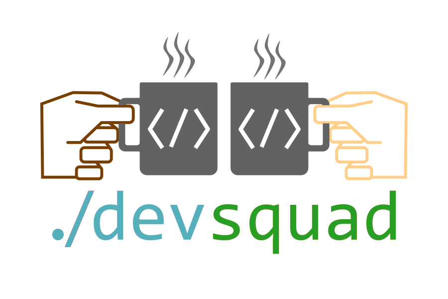

<h1 align="center">DevSquad GitHub Copilot</h1>

  

A delivery framework for GitHub Copilot with agents that guides teams from **business intent** to **implementation**, keeping the **why**, **what**, and **how** aligned through persistent artifacts and continuous feedback loops.

> [!WARNING]
> This project is under active development. It follows [semantic versioning](https://semver.org/); breaking changes may occur in minor releases until 1.0. See the [changelog](CHANGELOG.md) for release notes.

## How it Works

1. The framework makes structured thinking a prerequisite to action. Before any code is written, by a developer or an agent, it surfaces what matters first: what are the pain points, what are the business objectives, what does success look like. That's the **envisioning** phase, and it produces a short document the whole team can align on.

2. Once the vision is clear, the framework turns it into a **specification** through structured conversation: user stories with priorities, conformance criteria with concrete inputs and expected outputs, non-functional requirements with actual numbers. Not "make it fast", but "p95 latency under 200ms". The spec uses language that the whole team can read and validate, regardless of role. It captures *what* and *why*, never *how*.

3. With a signed-off spec, the framework shifts to **planning**: architecture decisions get recorded as ADRs (evaluated against ranked priorities, not generic pros/cons lists), engineering practices are discussed through Socratic questions, and a technical design emerges. Each decision is a persistent artifact that future developers and agents can trace back to.

4. Then the spec gets **decomposed** into user stories and tasks, organized by priority and dependency. Tasks are granular enough for a single implementation session, each with clear acceptance criteria. These flow into GitHub Issues or Azure DevOps as real work items, not just a checklist in a markdown file.

5. When it's time to build, the **implement** agent picks up a task, validates it against the spec, classifies its impact, writes code following TDD discipline, runs the build and tests, and commits with conventional commit messages. A separate **review** agent then validates the implementation against the spec, ADRs, and plan in an independent context, catching drift before it compounds.

6. Between sprints, a **refine** agent scans the backlog for staleness, spec/board inconsistencies, and items that need attention. A **security** agent runs architectural assessments during design and code-level scans during implementation.

7. The whole system is orchestrated by a coordinator agent that guides developers and agents through each phase with Socratic questions, delegates to 13 specialized sub-agents, and keeps every decision traceable from business intent to merged code. Because the framework is built on persistent artifacts (specs, ADRs, plans, tasks), any developer or agent can pick up where someone else left off.

8. And because it's extensible, you can add your own instructions, skills, agents, and hooks for your specific stack, domain, or organization. The framework adapts to how your team works, not the other way around.

## Design Principles

The framework is shaped by a few deliberate choices about how agents behave, how they're engineered, and how they fit into an existing codebase.

- **Socratic over prescriptive**: agents ask before they act. Scope, engineering practices, and architectural choices are surfaced as questions, not defaults silently applied on the user's behalf.
- **Human-in-the-loop by impact**: autonomy scales with risk. Low-impact changes execute directly, medium ones require a plan, and high-impact changes require explicit approval plus an ADR.
- **Context isolation by default**: sub-agents run in their own context windows and return only structured results, keeping the main conversation small and decisions traceable.
- **Principle of least privilege**: each agent exposes only the granular tools it needs, not full access to every MCP server. This reduces blast radius and cuts model overhead from oversized tool catalogs during selection.
- **Trusted MCP servers only**: the framework ships with a curated set of [first-party MCP servers](https://microsoft.github.io/devsquad-copilot/core-components/mcp-servers/). No opaque third-party servers are required, which keeps the tool surface reliable and makes enterprise security review straightforward.
- **Decisions as transparent artifacts**: every core architectural choice is documented as an [ADR](https://microsoft.github.io/devsquad-copilot/decisions/) with ranked priorities, evaluated options, and trade-offs, so contributors can trace *why* the framework behaves the way it does.
- **Extensibility without forking**: custom instructions, skills, agents, and hooks layer on top of the framework, so stack or domain adaptations don't require modifying core.
- **Minimal dependencies**: no framework-specific CLI, no Python runtime, no language-specific toolchain. Node.js is the only prerequisite, so onboarding and CI setup stay simple across stacks.

## Who is this for?

Teams where multiple developers share decisions, handoffs, and backlog coordination. Projects that need traceability and cross-role visibility through persisted artifacts (specs, ADRs, plans).

This is not a vibe-coding tool. If you are looking for one-shot, fully autonomous code generation without review, this framework will feel like friction, and that friction is intentional.

## Getting Started

See the [Getting Started guide](https://microsoft.github.io/devsquad-copilot/getting-started/) for installation on VS Code and GitHub Copilot CLI, prerequisites, and project initialization.

## Learn More

| | |
|---|---|
| [Full documentation](https://microsoft.github.io/devsquad-copilot/) | Framework architecture, core concepts, delivery guardrails, guides |
| [Agents catalog](https://microsoft.github.io/devsquad-copilot/agents/overview/) | All 13 agents and when to use each one |
| [Extensibility](https://microsoft.github.io/devsquad-copilot/extensibility/) | Add custom instructions, skills, agents, hooks, and tool extensions |
| [Changelog](CHANGELOG.md) | Release notes |
| [Contributing](CONTRIBUTING.md) | How to contribute |
| [Acknowledgments](ACKNOWLEDGMENTS.md) | Inspirations and credits |
