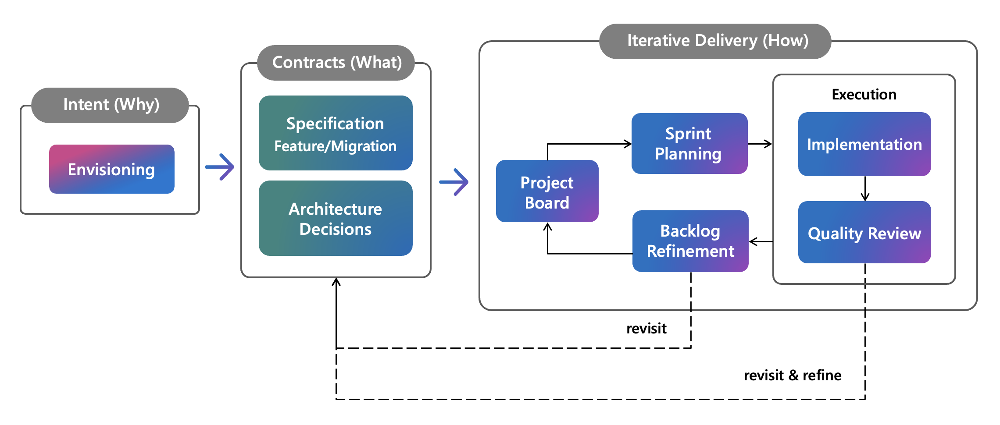

# DevSquad Delivery Framework

A GitHub Copilot delivery framework with guardrails to make AI-assisted development consistent, traceable, and maintainable.



## Structured Delivery at AI Speed

Shipping reliable enterprise software is a team activity. AI accelerates code generation, but also accelerates decisions, artifacts, and assumptions. Requirements evolve, architecture gets revisited, and parallel work often starts from incomplete or stale context. In fast-moving projects, staying aligned as the system evolves can be challenging.

The DevSquad Delivery Framework aims to bring structure to that speed. It embeds delivery guardrails directly into the development workflow through AI agents that guide each phase, from vision and specification through implementation and review, so teams move fast without losing traceability, consistency, or control.

## Who is this for?

* Multiple developers working on the same product, where handoffs, shared decisions, and backlog coordination are constant.
* Projects that require traceability and cross-role visibility. Persisted artifacts (specs, ADRs, plans) allow team members who miss some sessions to catch up through the repository, and reduce onboarding time for new contributors.

> [!NOTE]
> For smaller scopes (solo projects, prototypes, well-defined tasks), the full lifecycle may not be necessary. The framework is modular: you can invoke any agent directly (e.g., `sdd.implement` or `sdd.plan`) without going through the complete flow.

## What this is not

This framework is not a vibe-coding tool. It does not accept a single prompt and autonomously produce a finished system. Every phase includes human checkpoints: agents ask clarifying questions, propose plans for review, and wait for confirmation before executing high-impact changes.

If you are looking for one-shot, fully autonomous code generation without review, this framework will feel like friction — and that friction is intentional.

## Core Features

### Delivery Lifecycle

A conductor agent guides the workflow from vision through implementation and review; each specialized agent can also be invoked directly. Agents ask before assuming and scale ceremony to change impact.

### Backlog and Sprint Management

Specs decompose into prioritized tasks by user story, synced to GitHub Issues or Azure Boards. Sprint planning covers velocity, capacity, and committed versus stretch scope. Refinement detects inconsistencies and classifies item readiness.

### Security

* **Architectural**: STRIDE threat modeling, trust boundary mapping, attack surface analysis, ADR security implications, and Azure compliance checks. Produces a verdict with a security requirements checklist before implementation begins.

* **Code**: OWASP-categorized vulnerability analysis, credential detection, dependency CVE audit, and GitHub Advanced Security integration. Each finding includes severity, affected code, and remediation examples.

### Integrations

* **GitHub Issues and Azure Boards**: bidirectional sync for work items, iterations, and capacity
* **Microsoft Learn and Azure**: architecture and infra as code best practices, documentation lookup, code samples, and retail pricing estimates
* **Git**: branch strategy enforcement, conventional commits, and pull requests with automated review

### Extensibility

An extension agent guides creation of new skills, agents, hooks, and instructions for specific stacks, domains, or conventions tailored to the project needs.

## Getting Started

### Prerequisites

* Node.js 18+ (for lint hooks and MCP servers)
* **Copilot CLI** or **VS Code** with the [GitHub Copilot Chat](https://marketplace.visualstudio.com/items?itemName=GitHub.copilot-chat) extension
* **If using VS Code**: enable in extension settings:
  * `github.copilot.advanced.experimental.subagents` (required for sub-agents)
  * `github.copilot.advanced.experimental.memory` (optional, for cross-session memory)

### Installation

#### Option 1: Via Copilot CLI

1. Install the plugin:

   ```bash
   copilot plugin install https://github.com/microsoft/devsquad-copilot.git
   ```

2. To update:

   ```bash
   copilot plugin update devsquad
   ```

3. To uninstall:

   ```bash
   copilot plugin uninstall devsquad
   ```

#### Option 2: Via VS Code Agent Plugins

Add the repository as a plugin marketplace in your settings:

1. Ensure `chat.plugins.enabled` is set to `true` in VS Code settings.

2. Add the repository to `chat.plugins.marketplaces`:

   ```jsonc
   // settings.json
   "chat.plugins.marketplaces": [
       "microsoft/devsquad-copilot"
   ]
   ```

3. Open the Extensions view (`Ctrl+Shift+X` / `Cmd+Shift+X`), search for `@agentPlugins`, and install the **devsquad** plugin.

4. To manage installed plugins, open the **Agent Plugins - Installed** view in the Extensions sidebar, or select the **gear icon** in the Chat view and choose **Plugins**.

For more details, see the [VS Code Agent Plugins documentation](https://code.visualstudio.com/docs/copilot/customization/agent-plugins).

### Usage

#### Option 1: Guided (Recommended)

Use `sdd` as the entry point. It guides through phases, delegates to specialized sub-agents, and maintains context across phases.

#### Option 2: Direct

Invoke a specific agent based on your current state:

| You have... | Start with |
|-------------|-----------|
| A product idea without defined scope | `sdd.envision` to capture vision, pains, and objectives |
| A clear vision, ready to structure the backlog | `sdd.kickoff` to create epics and features |
| A defined feature to specify | `sdd.specify` to write the spec with requirements and conformance criteria |
| A spec ready for technical planning | `sdd.plan` to produce ADRs, contracts, and data models |
| Tasks ready to implement | `sdd.implement` to execute from tasks or work items |
| An existing backlog that needs organization | `sdd.refine` to detect inconsistencies and classify readiness |

For the full list of agents, see the [agent catalog](docs/framework/core-components/custom-agents.md).

## Tips for Effective Sessions

* **Run sessions as a group.** Bring people with different perspectives (business,
  architecture, implementation) together rather than running solo. This shortens decision loops and builds shared
  understanding. Rotate who drives between sessions or phases so everyone stays engaged
  and knowledge spreads across the team.

* **Elaborate together.** The agents start by asking clarifying questions about scope,
  constraints, and priorities. Answer as a team, but also bring context the agent would
  not know to ask for: recent decisions, failed approaches, team dependencies, or
  organizational constraints. Once the full picture is clear, let it draft a proposal.
* **Work in short "ask, propose, validate, execute" loops.** The agent asks, the team
  answers. The agent proposes, the team confirms or corrects. The agent executes, the
  team reviews. Repeat. This keeps momentum high without hiding critical decisions.

## Documentation

| Goal | Document |
|------|----------|
| Understand the framework architecture, decisions and use cases | [Framework Architecture](docs/framework/README.md) |
| Understand the approach used by the `extend` agent to guide the creation of skills, agents, instructions or hooks | [Extensibility](docs/framework/extensibility.md) |
| See what changed | [Changelog](CHANGELOG.md) |
