import { Card, CardGrid, Aside, Steps, Badge } from '@astrojs/starlight/components';

These seven agents form the primary delivery pipeline: from project setup through implementation.

```mermaid
flowchart LR
  init["init"]
  envision["envision"]
  kickoff["kickoff"]
  specify["specify"]
  plan["plan"]
  decompose["decompose"]
  implement["implement"]

  init -->|"config files"| envision
  envision -->|"envisioning.md"| kickoff
  kickoff -->|"board structure"| specify
  specify -->|"spec.md"| plan
  plan -->|"plan.md + ADRs"| decompose
  decompose -->|"tasks.md + work items"| implement
```

---

## devsquad.init <Badge text="Setup" variant="note" />

Initialize or update a project with SDD Framework files.

| | |
|---|---|
| **Produces** | Framework configuration files and templates |
| **Handoff** | to envision |
| **Skills** | init-config, init-docs, init-scaffold |

Three file groups managed:
- **Config**: `copilot-instructions.md`, 7 instruction files, coding guidelines, markdownlint config
- **Docs**: Templates for features, migrations, envisioning, ADRs
- **Scaffold**: Community files: `SECURITY.md`, `CONTRIBUTING.md`, `LICENSE`, `CODE_OF_CONDUCT.md`

Uses a deterministic shell script for file operations (verify, create, update, diff).

---

## devsquad.envision <Badge text="Vision" variant="success" />

Capture strategic vision through structured questions.

| | |
|---|---|
| **Produces** | `docs/envisioning/README.md` |
| **Handoff** | to kickoff |
| **Skills** | documentation-style, reasoning |

Five structured question blocks:
1. **Customer and Context**: Direct/end customer, domain, scale, existing systems
2. **Business Pain Points**: Top 3, measurable impact, primary area affected
3. **Technical Pain Points**: Fragmentation, scalability, security, observability, agility, integration
4. **Strategic Goals**: Business goal, technical goal, KPIs with target and baseline
5. **Constraints**: Regulatory, legacy, principles

Three modes: Interactive (guided questions), Direct (context provided), Incremental (update existing).

---

## devsquad.kickoff <Badge text="Structure" variant="success" />

Structure project hierarchy (epics, features, dependencies) and sync with the board.

| | |
|---|---|
| **Produces** | Board structure + `docs/envisioning/structure.md` (cache) |
| **Handoff** | to specify or plan |
| **Skills** | documentation-style, reasoning, work-item-creation, board-config, complexity-analysis |

<Aside>
  **Board is source of truth.** The `structure.md` file is a cache. GitHub Issues or Azure DevOps is authoritative.
</Aside>

Adaptive modes based on state detection:
- **[V] Vision only**: Create minimal structure; features added later
- **[E] Defined Scope**: Decompose into epics and features
- **[B] Existing Board**: Map existing items and propose adjustments
- **[Z] Zero**: Ask to start with envisioning or create minimal structure

Epic granularity test (4 criteria): independent delivery, distinct ownership, own timeline, autonomous existence.

---

## devsquad.specify <Badge text="Specification" variant="tip" />

Create or update feature/migration specifications with user stories and compliance criteria.

| | |
|---|---|
| **Produces** | `docs/features/*/spec.md` or `docs/migrations/*/spec.md` |
| **Handoff** | to plan or decompose |
| **Skills** | documentation-style, reasoning, quality-gate, complexity-analysis |

Key characteristics:
- User stories prioritized P1/P2/P3, independently testable
- Focus on WHAT/WHY, never HOW
- Written for business stakeholders, not developers
- Conformance table with minimum 3 cases (happy path, error, edge case)
- Supports both feature specs and migration specs (v0.5.0+)

---

## devsquad.plan <Badge text="Architecture" variant="tip" />

Technical planning with ADRs, data model, contracts, and architecture decisions.

| | |
|---|---|
| **Produces** | ADRs + `plan.md` + design decisions |
| **Handoff** | to decompose or security |
| **Skills** | documentation-style, reasoning, adr-workflow, complexity-analysis, engineering-practices |

Socratic approach to architecture:
- Explores options through questions, not prescriptions
- ADR creation with duplicate checking, Microsoft Learn lookup, Azure cost estimates
- Coordinator workflow can delegate context loading and architecture analysis to worker sub-agents before authoring design artifacts
- Security decisions trigger `devsquad.security` assessment
- Engineering practices guidance (CI/CD, branching, observability, IaC)

---

## devsquad.decompose <Badge text="Tasks" variant="caution" />

Decompose specs into user stories, tasks, and work items.

| | |
|---|---|
| **Produces** | `tasks.md` + work items on board |
| **Handoff** | to implement |
| **Skills** | documentation-style, reasoning, work-item-creation, complexity-analysis, work-item-workflow, board-config |

11-step flow: Configuration, Detect environment, Sync board, Load design docs, Identify missing ADRs, Generate tasks, Save draft, Present for confirmation, Create work items, Validate, Report.

Task organization by user story: **Models, Services, Endpoints, Integration**

Mandatory phases: Setup, Foundational, User Stories (P1, P2, P3), Polish

<Aside type="caution">
  Missing ADRs block the Foundational phase. Tests are integrated as acceptance criteria, not as separate test tasks.
</Aside>

---

## devsquad.implement <Badge text="Code" variant="danger" />

Execute implementation from `tasks.md`, a GitHub issue, or an Azure DevOps work item.

| | |
|---|---|
| **Produces** | Source code + Pull Request |
| **Handoff** | to review |
| **Skills** | documentation-style, reasoning, work-item-creation, git-branch, pull-request |

Key characteristics:
- **Socratic coaching**: Guides developers to find answers, not direct solutions
- **Coordinator workflow**: Delegates validation, execution, verification, and finalization to focused workers with isolated context
- **Quality checks**: IDE problems detection, test failure analysis
- **Git workflow**: Branch creation following detected strategy, conventional commits
- **PR automation**: Automated reviews, technical debt tracking, Copilot review option
- **One task at a time**: Soft limit of 3 in-progress with warning signal

---

## What to Read Next

- [Support Agents](/agents/support/) for review, security, and sprint agents
- [Skills](/skills/) for capabilities used by lifecycle agents
