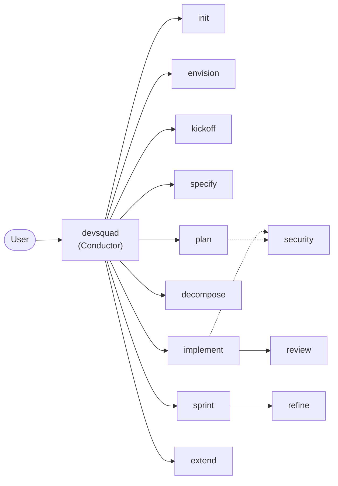

import { Card, CardGrid, LinkCard, Aside } from '@astrojs/starlight/components';

The DevSquad framework is powered by 13 specialist agents, each responsible for a distinct phase of the delivery lifecycle. They can be orchestrated by the central conductor (`@devsquad`) or invoked directly.

## Agent Flow

## Agent Summary

| Agent | Purpose | Produces | Next |
|-------|---------|----------|------|
| `devsquad` | Conductor | Context and phase detection | Any sub-agent |
| `devsquad.init` | Initialize project | Framework files and templates | envision |
| `devsquad.envision` | Capture strategic vision | `docs/envisioning/README.md` | kickoff |
| `devsquad.kickoff` | Structure project hierarchy | Board structure + `structure.md` | specify or plan |
| `devsquad.specify` | Write feature specs | `docs/features/*/spec.md` | plan or decompose |
| `devsquad.plan` | Technical planning | ADRs + `plan.md` | decompose or security |
| `devsquad.decompose` | Decompose to tasks | `tasks.md` + work items | implement |
| `devsquad.implement` | Execute code | Source code + PR | review |
| `devsquad.review` | Validate implementation | Review log with findings | implement or plan |
| `devsquad.security` | Security assessment | Security report | implement or review |
| `devsquad.sprint` | Sprint planning | `sprint-N.md` + scope options | plan or decompose |
| `devsquad.refine` | Backlog health | Analysis report + fixes | specify or kickoff |
| `devsquad.extend` | Framework extension | Custom components | varies |

## By Category

<CardGrid>
  <LinkCard title="Conductor" href="/devsquad-copilot/agents/conductor/" description="The central orchestrator that detects intent and delegates to specialists." />
  <LinkCard title="Lifecycle Agents" href="/devsquad-copilot/agents/lifecycle/" description="init, envision, kickoff, specify, plan, decompose, implement — the main delivery pipeline." />
  <LinkCard title="Support Agents" href="/devsquad-copilot/agents/support/" description="review, security, sprint, refine, extend — quality, planning, and extensibility." />
</CardGrid>
