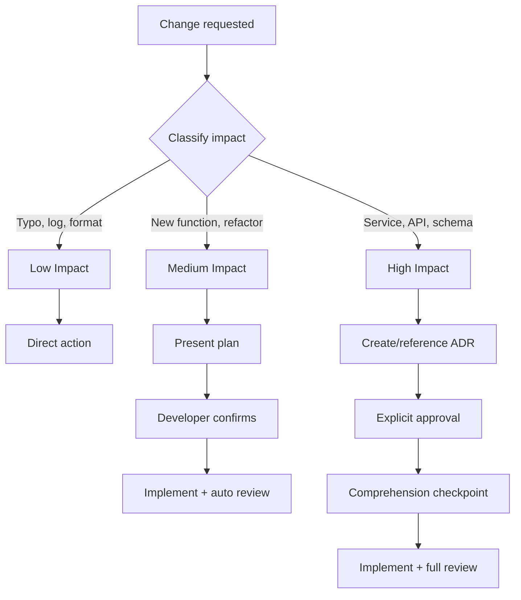

import { Card, CardGrid, Aside, Steps } from '@astrojs/starlight/components';

Every change is classified by impact **before** the agent acts. This determines the level of ceremony, verification, and approval required.

## Impact Levels

<CardGrid>
  <Card title="Low Impact" icon="approve-check">
    **Examples**: Typo fix, log message, formatting change.

    **Behavior**: Direct action, no checkpoints. Skips validation against spec, comprehension checkpoint, reasoning log, and pre-PR review.
  </Card>
  <Card title="Medium Impact" icon="information">
    **Examples**: New function, local refactoring, adding a validation.

    **Behavior**: Plan + confirmation + automated review. The agent presents the approach and waits for the developer to confirm understanding.
  </Card>
  <Card title="High Impact" icon="warning">
    **Examples**: New service, schema change, public API modification.

    **Behavior**: Mandatory ADR + explicit approval + full review + all checkpoints. Not eligible for streamlined mode.
  </Card>
</CardGrid>

## Decision Flow

## Reclassification

If a task classified as low turns out to be more complex during implementation, it is reclassified upward to medium. The agent pauses and applies the appropriate ceremony.

<Aside type="tip">
  Impact classification is based on risk and scope, not the developer's opinion. A "simple" change to a public API is still high impact regardless of how few lines of code it requires.
</Aside>

## What Each Level Skips or Requires

| Checkpoint | Low | Medium | High |
|-----------|:---:|:------:|:----:|
| Validation against spec | Skip | Apply | Apply |
| Comprehension checkpoint | Skip | Apply | Apply |
| Reasoning log entry | Skip | Optional | Required |
| Pre-PR review | Skip | Automated | Full review |
| ADR required | No | No | Yes |
| Trade-off explanation | No | Yes | Yes |
| Developer approval | No | Yes | Yes + explicit |

## Related

- [Comprehension Checkpoints](/devsquad-copilot/concepts/comprehension-checkpoints/): What happens during medium and high impact tasks
- [Delivery Guardrails](/devsquad-copilot/delivery-guardrails/): The philosophy behind structured verification
- [ADR 0005: Socratic AI](/devsquad-copilot/decisions/): The decision behind adaptive ceremony

---
## What to Read Next

- [Comprehension Checkpoints](/devsquad-copilot/concepts/comprehension-checkpoints/) for how checkpoints vary by impact level
- [Implementation Guardrails](/devsquad-copilot/guardrails/implementation/) for how classification affects workflow
