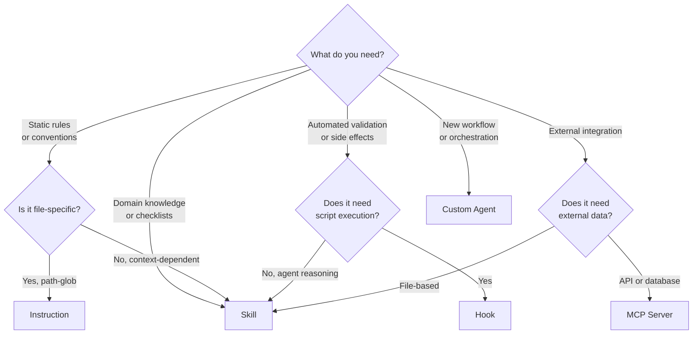

This page helps you decide which DevSquad extension mechanism fits your use case. Each mechanism serves a different purpose, and choosing the right one avoids unnecessary complexity.

## Quick Decision Guide

| I want to... | Use |
|---|---|
| Enforce formatting or naming rules on specific files | [Instructions](/devsquad-copilot/core-components/instructions/) |
| Add domain knowledge that agents load when relevant | [Skills](/devsquad-copilot/skills/) |
| Run validation scripts at specific lifecycle points | [Hooks](/devsquad-copilot/core-components/hooks/) |
| Connect agents to external data or APIs | [MCP Servers](/devsquad-copilot/core-components/mcp-servers/) |
| Create a new workflow or specialized behavior | [Custom Agent](/devsquad-copilot/extensibility/) |

## Detailed Comparison

| Dimension | Instructions | Skills | Hooks | MCP Servers | Custom Agents |
|---|---|---|---|---|---|
| **Activation** | Automatic (path glob) | Semantic (description match) | Event-driven (lifecycle point) | Tool call by agent | User or coordinator invocation |
| **Context cost** | Always loaded for matching files | Loaded only when relevant | None (runs externally) | Per tool call | Full context window |
| **Determinism** | High (static rules) | Medium (LLM interprets) | High (script output) | Medium (external data) | Low (LLM reasoning) |
| **Complexity** | Low (markdown file) | Medium (structured directory) | Medium (script + JSON) | High (server setup) | High (agent definition) |
| **Best for** | Style rules, conventions | Domain knowledge, checklists | Validation, automation | External integrations | New workflows |

## Decision Flowchart

## Common Mistakes

- **Using a skill when an instruction suffices**: If the rule is static and file-specific (e.g., "all API routes must use async handlers"), use an instruction. Skills are for context-dependent knowledge.
- **Using a hook when a skill would work**: Hooks run shell scripts and have timeout limits. If you need the agent to reason about the output, a skill with just-in-time file loading is simpler.
- **Creating a custom agent for a single capability**: If you just need to add knowledge (not a new workflow), a skill is the right choice. Agents are for orchestrating multi-step processes.

:::tip
Run `@devsquad.extend` in Copilot Chat for interactive guidance that walks you through this decision based on your specific use case.
:::

## What to Read Next

- [Extensibility Overview](/devsquad-copilot/extensibility/) for the full decision tree
- [Extension Recipes](/devsquad-copilot/extensibility/recipes/) for step-by-step examples
