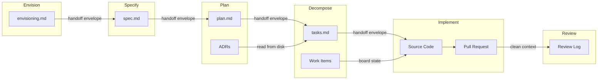

import { Card, CardGrid, Aside, Steps } from '@astrojs/starlight/components';

Agents use a multi-layered approach to manage context across phases and sessions, preventing assumption contamination while maintaining traceability.

## Disk Artifacts (Source of Truth)

All persistent state lives in versioned files on disk. Board is the source of truth for **task status and ownership**. Disk artifacts are the source of truth for **design decisions, specifications, and architecture**.

| Artifact | Path | Phase |
|----------|------|-------|
| Strategic vision | `docs/envisioning/README.md` | Envision |
| Feature specification | `docs/features/*/spec.md` | Specify |
| Technical plan | `docs/features/*/plan.md` | Plan |
| Task decomposition | `docs/features/*/tasks.md` | Decompose |
| Architecture decisions | `docs/architecture/decisions/*.md` | Plan |
| Migration specification | `docs/migrations/*/spec.md` | Specify |
| Migration tasks | `docs/migrations/*/tasks.md` | Decompose |
| Sprint records | `docs/sprints/sprint-N.md` | Sprint |

## Copilot Memory

Built-in memory that stores stable facts discovered during work:

- **Code conventions**: Detected patterns and project-specific rules
- **Verified commands**: Build, test, and deployment commands that work
- **Synchronization patterns**: Board and repository sync status
- **Project structure**: Key directories, entry points, and configuration

Characteristics: automatic, validated via citations, shared between agents, expires in 28 days.

Used by: implement, plan, review, security agents.

## Handoff Envelope

Structured context passing between phases ([ADR 0003](../../decisions/#adr-0003-context-management-)):

<CardGrid>
  <Card title="Relevant Artifacts" icon="document">
    Paths to files the next phase should read (spec.md, plan.md, ADRs, tasks.md).
  </Card>
  <Card title="Inherited Assumptions" icon="information">
    Decisions and assumptions from the current phase that carry forward.
  </Card>
  <Card title="Pending Decisions" icon="warning">
    Open questions or decisions that the next phase needs to resolve.
  </Card>
  <Card title="Discarded Information" icon="close">
    Context that was considered but explicitly excluded from the handoff.
  </Card>
</CardGrid>

<Aside>
  Each phase starts with **clean context** and reads artifacts from disk. This isolation prevents assumption contamination from previous phases.
</Aside>

## Context Flow Between Phases

Each arrow represents a phase boundary where context is explicitly passed via a handoff envelope or read from disk artifacts. Agents never inherit the previous phase's working memory.

## Phase Cleanup Points

<Steps>
1. **specify to plan**: Spec locked, plan starts fresh reading spec from disk
2. **plan to decompose**: ADRs locked, decompose reads decisions from files
3. **decompose to implement**: Tasks locked, implement picks one task at a time
4. **implement to review**: Code committed, review reads independently with clean context
</Steps>

## Session Memory

The `.memory/` directory stores session-scoped configuration (not committed to git):

| File | Purpose | Populated By |
|------|---------|-------------|
| `board-config.md` | Detected work item platform | `detect-repo-platform.sh` hook |
| `git-config.md` | Detected branching strategy | `detect-branching-strategy.sh` hook |

---
## What to Read Next

- [Reasoning and Handoff](../../concepts/reasoning-and-handoff/) for how decisions transfer between agents
- [Hooks](../../core-components/hooks/) for lifecycle automation points
