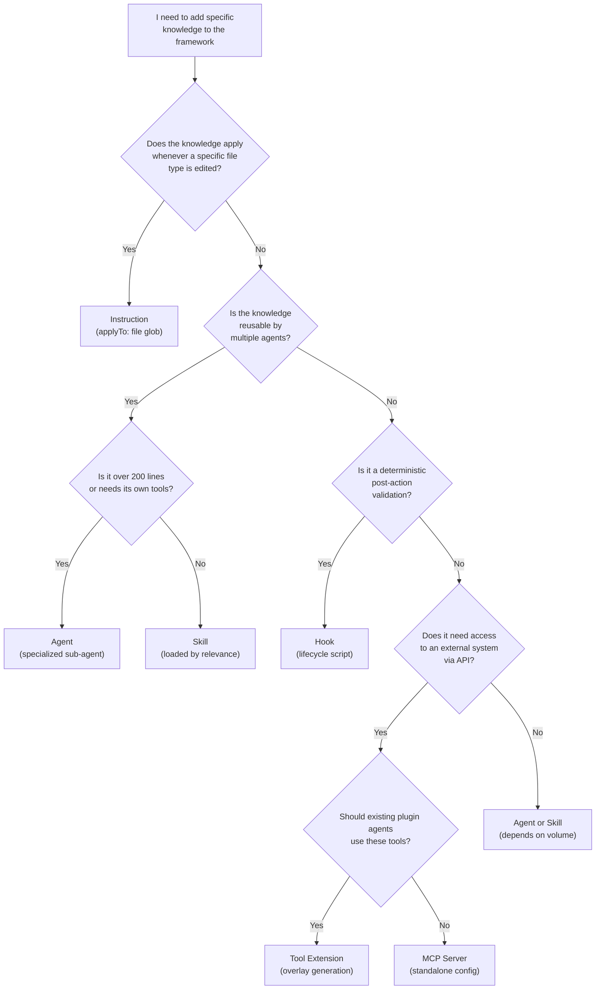

import { Card, CardGrid, Aside, Steps, Tabs, TabItem, FileTree, LinkCard } from '@astrojs/starlight/components';

The framework is designed to be extended. Six mechanisms are available, each with different activation models, context costs, and complexity.

:::tip
Not sure which extension mechanism to use? Run `@devsquad.extend` in Copilot Chat for interactive guidance that walks you through the decision.
:::

## Extension Mechanisms

| Mechanism | Activation | Context Cost | Size |
|-----------|-----------|-------------|------|
| **Instructions** | Deterministic (file glob) | Always loaded in scope | < 50 lines |
| **Skills** | Semantic (description) | On demand | 50-200 lines |
| **Agents** | Explicit (invocation) | Isolated | > 200 lines |
| **Hooks** | Automatic (lifecycle) | Zero (external) | Any |
| **MCP Servers** | Per tool call | On demand | Any |
| **Tool Extensions** | Per sync | Same as base agent | YAML patch |

## Decision Tree



## Creating Extensions

<Tabs>
  <TabItem label="Instructions">
    Path-scoped rules applied when editing matching files.

    - Use `applyTo` glob in frontmatter
    - Keep under 50 lines
    - Concise, actionable rules (not documentation)
    - One per artifact type

    **Example**:

    ```markdown
    <!-- .github/instructions/python.instructions.md -->
    ---
    applyTo: "**/*.py"
    ---
    # Python - Project Conventions

    - Type hints required on every public signature
    - Domain errors inherit from `AppError` (src/core/errors.py)
    - Async by default for I/O (httpx, asyncpg)
    - Tests with pytest; shared fixtures in conftest.py
    - Imports organized: stdlib, third-party, local
    ```
  </TabItem>
  <TabItem label="Skills">
    Reusable knowledge packages loaded on demand.

    - Directory name = frontmatter `name` (kebab-case)
    - Description optimized for semantic trigger (include keywords, use/don't-use scenarios)
    - Maximum 500 lines

    **Example**:

    ```markdown
    <!-- .github/skills/resilience-patterns/SKILL.md -->
    ---
    name: resilience-patterns
    description: Retry, circuit breaker, and fallback patterns.
      Use when implementing external service calls, HTTP
      clients, or database connections. Do not use for
      in-memory operations.
    ---
    # Resilience Patterns

    ## Retry
    - Exponential backoff with jitter
    - Maximum 3 retries for transient failures

    ## Circuit Breaker
    - Failure threshold: 5 consecutive failures
    - Half-open after 30 seconds
    ```
  </TabItem>
  <TabItem label="Agents">
    Specialized workflows with isolated context.

    - Naming: `devsquad.<phase>.agent.md`
    - Required frontmatter: `description`, `tools`
    - Modalities: Direct (user selects), Sub-agent (programmatic), Both
    - Nested sub-agent invocation supported up to 5 levels in VS Code 1.113+
    - Internal workers should set `user-invocable: false` and keep tool sets minimal

    **Example frontmatter**:

    ```yaml
    ---
    description: Python implementation specialist. Invoked by
      devsquad.implement for task execution in Python projects.
    tools:
      - edit/editFiles
      - edit/createFile
      - execute/runInTerminal
      - search/codebase
    ---
    ```
  </TabItem>
  <TabItem label="Hooks">
    External scripts triggered by lifecycle events.

    - Bash scripts with shebang
    - JSON output on single line
    - 30-second default timeout
    - Register in `hooks.json`
    - Events: `sessionStart`, `preToolUse`, `postToolUse`, `sessionEnd`

    **Example**:

    ```bash
    #!/bin/bash
    # validate-python-imports.sh (postToolUse)

    FILE="$1"
    if [[ "$FILE" != *.py ]]; then
      echo '{"status":"skipped"}'
      exit 0
    fi
    RESULT=$(ruff check "$FILE" --select I 2>&1)
    if [ $? -eq 0 ]; then
      echo '{"status":"pass"}'
    else
      echo '{"status":"fail","details":"import issues"}'
    fi
    ```
  </TabItem>
  <TabItem label="Tool Extensions">
    Inject any MCP server tools into existing plugin agents via YAML patches. (Preview, [ADR 0010](/decisions/#adr-0010-agent-tool-extension-))

    - Consumer creates `.github/devsquad/tool-extensions/*.yml`
    - Sync script generates workspace-level agent overrides in `.github/agents/`
    - `sessionStart` hook detects when extensions are stale or unsynced

    **Example**:

    ```yaml
    # .github/devsquad/tool-extensions/jira.yml
    name: jira
    description: Jira integration for work items
    mcp:
      server: "@atlassian/jira-mcp"
      transport: stdio
    agents:
      - devsquad.kickoff
      - devsquad.decompose
    ```
  </TabItem>
</Tabs>

## Extension File Locations

<FileTree>
- .github/
  - instructions/ (deterministic, by file glob)
  - skills/ (semantic, on demand)
    - resilience-patterns/
      - SKILL.md
  - agents/ (explicit invocation)
    - devsquad.implement-python.agent.md
  - plugins/devsquad/
    - hooks/ (lifecycle scripts)
      - hooks.json
  - devsquad/
    - tool-extensions/ (MCP tool injection)
</FileTree>

<Aside type="tip">
  Use `@devsquad.extend` to get interactive guidance for creating any extension type.
</Aside>

## Next Steps

<CardGrid>
  <LinkCard title="Extension Recipes" href="/extensibility/recipes/" description="Step-by-step examples for creating instructions, skills, agents, and hooks." />
  <LinkCard title="Skills Reference" href="/skills/" description="All 18 built-in skills with activation model." />
  <LinkCard title="Core Components" href="/core-components/instructions/" description="Built-in instructions, hooks, MCP servers, and context management." />
</CardGrid>

---

## What to Read Next

- [Extension Recipes](/extensibility/recipes/) for step-by-step examples
- [Contributing](/contributing/) for contribution guidelines
