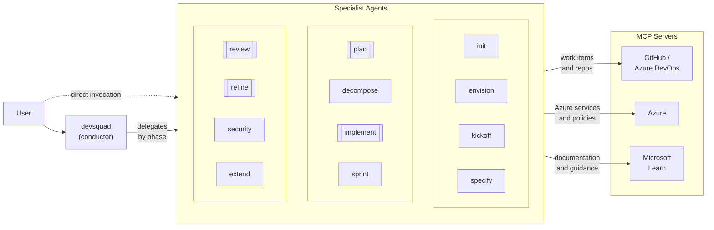
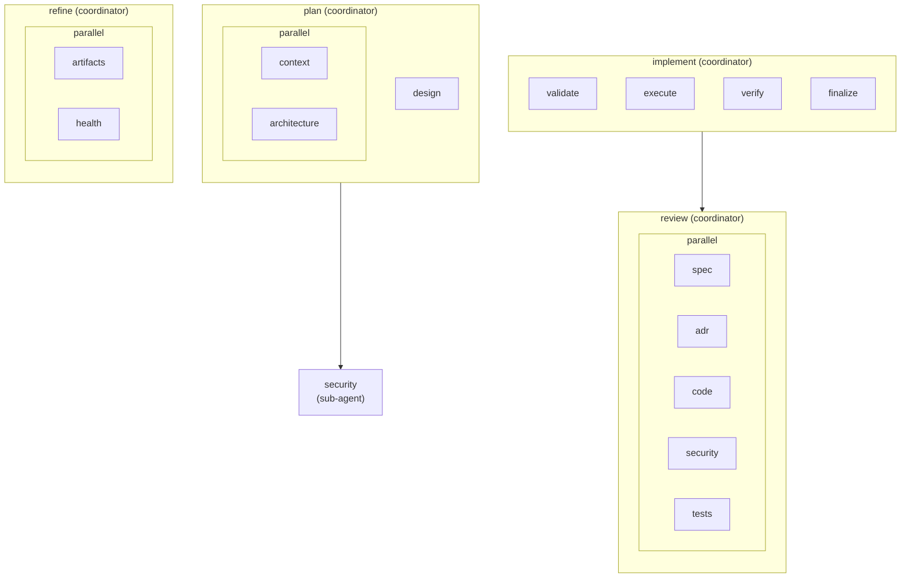

import { Card, CardGrid, Aside, Tabs, TabItem } from '@astrojs/starlight/components';

## Design Principles

<CardGrid stagger>
  <Card title="1. Flexibility" icon="random">
    Users choose between guided mode (through the conductor) or direct mode (invoking specialist agents individually). Both paths produce the same artifacts.
  </Card>
  <Card title="2. Socratic by Design" icon="approve-check">
    Ask before assuming. Verify understanding before acting. Explain the *why* behind recommendations so teams learn the principles, not just the steps.
  </Card>
  <Card title="3. Artifacts as Source of Truth" icon="document">
    Specs, ADRs, and contracts live in files on disk. Session context is ephemeral; the artifacts in the repository are the permanent reference.
  </Card>
  <Card title="4. Language-Agnostic" icon="translate">
    The framework does not prescribe a tech stack. Users add context via instructions, skills, hooks, and tool extensions.
  </Card>
  <Card title="5. AI Model-Agnostic" icon="setting">
    Does not prescribe which AI models to use. Organizations choose per their policies and requirements.
  </Card>
  <Card title="6. Human in Control" icon="warning">
    No medium or high impact decision is executed without explicit approval. The developer decides; the AI accelerates.
  </Card>
</CardGrid>

## Architecture Overview

The architecture spans three main phases:

| Phase | Focus | Key Agents |
|-------|-------|------------|
| **Intent (Why)** | Strategic vision | envision, kickoff |
| **Contracts (What)** | Specifications + ADRs | specify, plan |
| **Iterative Delivery (How)** | Board → Sprint → Implement → Review → Refine | decompose, sprint, implement, review, refine, security |

### Agent Interaction

The framework follows a conductor pattern: the user interacts with the `devsquad` conductor, which delegates to specialist agents by phase. Complex specialist agents also act as coordinators, delegating to focused worker sub-agents with isolated context. This nested sub-agent architecture enables parallel execution and context isolation without adding extra user requests.

Double-bordered nodes are coordinator agents. They can delegate internally to worker sub-agents.

### Nested Sub-agent Detail

The current worker topology centers on `plan`, `implement`, `review`, and `refine`. Workers run with isolated context windows and are hidden from the user-facing agent picker.

<Aside type="tip">
  Nested sub-agent workflows require VS Code 1.113.0 or later and the `chat.subagents.allowInvocationsFromSubagents` setting enabled.
</Aside>

## Conductor Pattern

The central `devsquad` agent implements a **Mediated Coordinator-Worker** pattern (ADR 0001):

- Detects user intent and delegates to the appropriate specialist agent
- Allows coordinator specialists to continue delegation to focused worker sub-agents
- **Dual-mode**: guided (through conductor) or direct (invoke specialists)
- **Resilient**: if the conductor fails, specialist agents remain accessible independently
- **No domain logic**: the conductor routes and relays; specialists own all phase logic

## Communication Protocol

Sub-agents operate in two modes via a prefix-based protocol (ADR 0002):

| Mode | Trigger | Behavior |
|------|---------|----------|
| **Via Conductor** | `[CONDUCTOR]` prefix present | Returns structured actions: `[ASK]`, `[CREATE]`, `[EDIT]`, `[BOARD]`, `[CHECKPOINT]`, `[DONE]` |
| **Direct** | No prefix | Interacts directly with the user |

Single codebase handles both modes — the prefix check determines the output format.

## Context Management

Phases execute sequentially or across sessions. Context isolation prevents assumption contamination (ADR 0003):

- **Disk artifacts** are the source of truth (`spec.md`, `plan.md`, ADRs, `tasks.md`)
- Each phase starts with **clean context** and reads artifacts from disk
- **Handoff Envelope** explicitly transfers inherited assumptions, pending decisions, and discarded info
- Persistence via git; auditability via versioned artifacts

## Component Catalog

| Component | Count | Description |
|-----------|-------|-------------|
| [Agents](/devsquad-copilot/agents/overview/) | 13 visible + internal workers | One conductor, 12 specialist agents, and hidden worker sub-agents for nested execution |
| [Skills](/devsquad-copilot/skills/) | 18 | Reusable capabilities loaded on demand |
| [Instructions](/devsquad-copilot/core-components/instructions/) | 7 | Path-specific behavioral rules |
| [Hooks](/devsquad-copilot/core-components/hooks/) | 5 | Lifecycle hooks for deterministic operations |
| [MCP Servers](/devsquad-copilot/core-components/mcp-servers/) | 5 | Remote servers for external integrations |
| [Context Management](/devsquad-copilot/core-components/context-management/) | — | Memory, handoff envelopes, disk persistence |
| [Extensibility](/devsquad-copilot/extensibility/) | 6 | Extension mechanisms for customization |

## Usage Scenarios

<Tabs>
  <TabItem label="Feature-first">
    Start with a clear product idea and work through the full lifecycle.

    `envision → kickoff → specify → plan → decompose → implement → review`

    Features are defined during envisioning, then specified, planned, and implemented in sequence.
  </TabItem>
  <TabItem label="Architecture-first">
    Start with technical decisions before feature work.

    `envision → kickoff → plan → specify → decompose → implement`

    Architecture decisions (ADRs) are made first, then features are specified to align with them.
  </TabItem>
  <TabItem label="Validation-first">
    Build a PoC first, validate assumptions, then build the MVP.

    `envision → kickoff → plan → decompose → implement` (PoC) → validate → full cycle (MVP)
  </TabItem>
  <TabItem label="Board-first">
    Map an existing board structure and fill in specs.

    `kickoff (map existing) → specify → plan → decompose → implement`
  </TabItem>
  <TabItem label="Iterative">
    Discover scope incrementally as you specify and plan.

    `specify → plan → discover B → specify → plan → decompose → implement`
  </TabItem>
</Tabs>

## Known Limitations

<Aside type="caution">
  - **No automatic impact propagation**: When specs or ADRs are updated, dependent artifacts are not automatically refreshed. Use `@devsquad.refine` to detect inconsistencies.
  - **Single board assumption**: The framework assumes a single GitHub Issues or Azure DevOps board. Cross-platform sync is not supported.
</Aside>

## Versioning

The framework uses **Semantic Versioning** with git tags (`vMAJOR.MINOR.PATCH`):

| Change Type | Version Bump | Example |
|-------------|-------------|---------|
| Bug fixes, no behavior change | PATCH | v0.6.0 → v0.6.1 |
| New backward-compatible features | MINOR | v0.5.0 → v0.6.0 |
| Breaking changes | MAJOR | v0.x → v1.0.0 |
