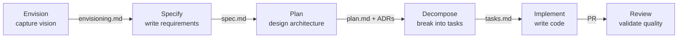

import { Steps, Aside, Tabs, TabItem } from '@astrojs/starlight/components';

This walkthrough follows a realistic feature through every phase of the DevSquad delivery workflow. By the end, you will understand how agents collaborate, where artifacts are created, and how guardrails keep the process on track.

## Start the Conductor

Open the conductor and describe what you want to build. It will guide you through each phase in sequence.

<Tabs syncKey="platform">
  <TabItem label="VS Code" icon="vscode">
    ```
    /agents devsquad

    I want to add user notification preferences - users should choose which
    notifications they receive and through which channels (email, push, in-app).
    ```
  </TabItem>
  <TabItem label="GitHub Copilot CLI" icon="github">
    ```bash
    copilot --agent devsquad:devsquad
    # then: I want to add user notification preferences - users should choose which
    # notifications they receive and through which channels (email, push, in-app).
    ```
  </TabItem>
</Tabs>

## Workflow Overview



## What Happens at Each Phase

<Steps>

1. **Capture the Vision** (delegates to `devsquad.envision`)

   The conductor starts by routing to the envisioning agent, which asks structured questions about the customer, pain points, business goals, and success criteria. It produces an envisioning document.

   **Artifact produced**: `docs/envisioning/notification-preferences.md`

2. **Write the Specification** (delegates to `devsquad.specify`)

   The conductor moves to specification. The agent transforms the vision into testable requirements, asking clarifying questions (What channels? What defaults? What happens when a channel is unavailable?) and producing a spec with user stories prioritized as P1/P2/P3, functional requirements, and conformance criteria.

   **Artifact produced**: `docs/features/notification-preferences/spec.md`

3. **Plan the Implementation** (delegates to `devsquad.plan`)

   The conductor routes to planning. The agent reads the spec, analyzes the existing codebase, and produces a technical design. It evaluates architecture impact, checks for ADR conflicts, and may trigger an ADR if a significant technical decision is needed (e.g., where to store preferences).

   **Artifact produced**: `docs/features/notification-preferences/plan.md`

4. **Decompose into Tasks** (delegates to `devsquad.decompose`)

   The conductor moves to decomposition. The agent breaks the plan into implementable tasks organized by user story, following the pattern: Models, Services, Endpoints, Integration. Tasks can be created as work items on GitHub Issues or Azure DevOps.

   **Artifact produced**: `docs/features/notification-preferences/tasks.md`

5. **Implement** (delegates to `devsquad.implement`)

   The conductor picks a task and starts implementation. The agent classifies the task by impact (low/medium/high), runs comprehension checkpoints to verify understanding, writes tests first (TDD), implements the code, and verifies the build passes.

   **Artifacts produced**: Source code files, test files, commits

6. **Review** (delegates to `devsquad.review`)

   After implementation, the conductor triggers review. The agent runs 5 parallel workers checking: spec compliance, ADR adherence, code quality, security, and test coverage. Each finding requires evidence and is classified by severity.

   **Artifact produced**: Review log with findings

</Steps>

## Key Observations

- **Artifacts drive the workflow**: Each phase reads artifacts from the previous phase and produces new ones. This creates a traceable chain from vision to code.
- **Guardrails are automatic**: Impact classification, comprehension checkpoints, and review gates activate based on the nature of the change, not manual configuration.
- **Human stays in control**: The framework asks for confirmation at critical decision points. You can override, skip, or redirect at any time.

## What to Read Next

- [Delivery Guardrails](/delivery-guardrails/) for the philosophy behind the workflow
- [Agents Overview](/agents/overview/) for the full agent catalog
- [Extensibility](/extensibility/) to customize agents, skills, and hooks for your stack
