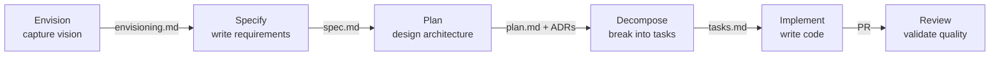

import { Steps, Aside } from '@astrojs/starlight/components';

This walkthrough follows a realistic feature through every phase of the DevSquad delivery workflow. By the end, you will understand how agents collaborate, where artifacts are created, and how guardrails keep the process on track.

## Workflow Overview



## The Scenario

You are adding a **user notification preferences** feature to an existing web application. Users should be able to choose which notifications they receive and through which channels.

## The Workflow

<Steps>

1. **Capture the Vision** (`@devsquad.envision`)

   Start by describing the problem to the envisioning agent:

   ```
   @devsquad.envision We need to let users control their notification preferences - 
   which notifications they get and through what channels (email, push, in-app).
   ```

   The agent asks structured questions about the customer, pain points, business goals, and success criteria. It produces an **envisioning document** in `docs/envisioning/`.

   **Artifact produced**: `docs/envisioning/notification-preferences.md`

2. **Write the Specification** (`@devsquad.specify`)

   The specification agent transforms the vision into testable requirements:

   ```
   @devsquad.specify Create a feature spec for notification preferences based on the envisioning doc
   ```

   It asks clarifying questions (What channels? What defaults? What happens when a channel is unavailable?) and produces a spec with user stories prioritized as P1/P2/P3, functional requirements, and conformance criteria.

   **Artifact produced**: `docs/features/notification-preferences/spec.md`

3. **Plan the Implementation** (`@devsquad.plan`)

   The planning agent reads the spec, analyzes the existing codebase, and produces a technical design:

   ```
   @devsquad.plan Plan the implementation for notification-preferences
   ```

   It evaluates architecture impact, checks for ADR conflicts, and may trigger an ADR if a significant technical decision is needed (e.g., where to store preferences). The plan includes data model, API contracts, and infrastructure mapping.

   **Artifact produced**: `docs/features/notification-preferences/plan.md`

4. **Decompose into Tasks** (`@devsquad.decompose`)

   The decomposition agent breaks the plan into implementable tasks organized by user story:

   ```
   @devsquad.decompose Break down the notification-preferences plan into tasks
   ```

   Tasks follow the pattern: Models, Services, Endpoints, Integration. Each task is sized and can be created as work items on GitHub Issues or Azure DevOps.

   **Artifact produced**: `docs/features/notification-preferences/tasks.md`

5. **Implement** (`@devsquad.implement`)

   Pick a task and start implementing:

   ```
   @devsquad.implement Work on task "Create preference data model"
   ```

   The implement agent classifies the task by impact (low/medium/high), runs comprehension checkpoints to verify understanding, writes tests first (TDD), implements the code, and verifies the build passes. For high-impact tasks, it requires explicit approval before proceeding.

   **Artifacts produced**: Source code files, test files, commits

6. **Review** (`@devsquad.review`)

   After implementation, the review agent validates the work:

   ```
   @devsquad.review Review the notification-preferences implementation
   ```

   It runs 5 parallel workers checking: spec compliance, ADR adherence, code quality, security, and test coverage. Each finding requires evidence and is classified by severity.

   **Artifact produced**: Review log with findings

</Steps>

<Aside type="tip">
You don't have to follow every phase sequentially. Use `@devsquad` (the conductor) and describe what you need, and it will route you to the right agent based on your project's current state.
</Aside>

## Key Observations

- **Artifacts drive the workflow**: Each phase reads artifacts from the previous phase and produces new ones. This creates a traceable chain from vision to code.
- **Guardrails are automatic**: Impact classification, comprehension checkpoints, and review gates activate based on the nature of the change, not manual configuration.
- **Human stays in control**: The framework asks for confirmation at critical decision points. You can override, skip, or redirect at any time.

## What to Read Next

- [Getting Started](/devsquad-copilot/getting-started/) to install and try this yourself
- [Agents Overview](/devsquad-copilot/agents/overview/) for the full agent catalog
- [Delivery Guardrails](/devsquad-copilot/delivery-guardrails/) for the philosophy behind the workflow
