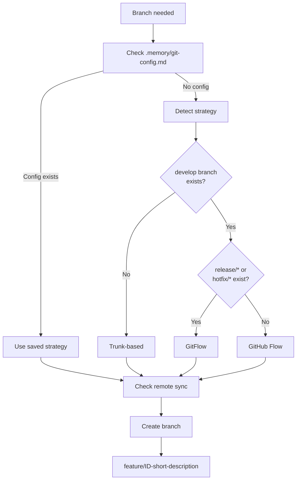
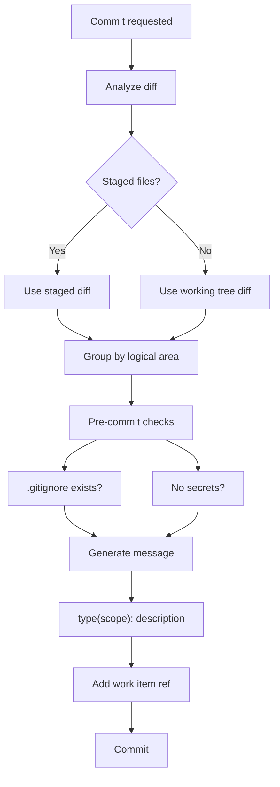
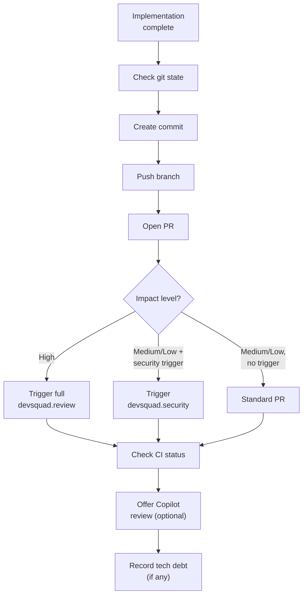
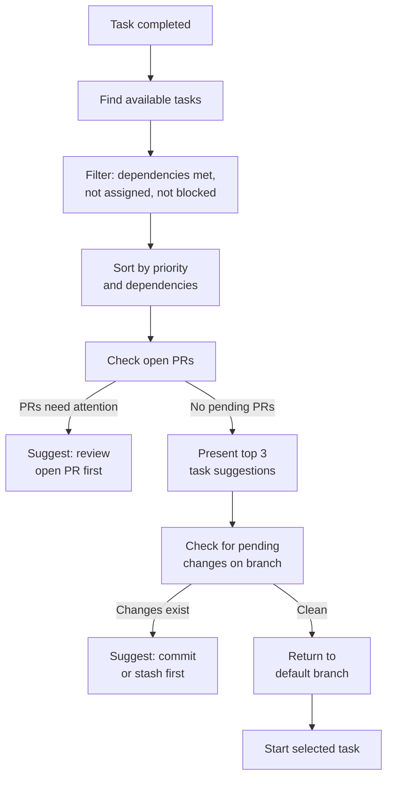

import { Aside, Badge } from '@astrojs/starlight/components';

These four skills manage the development workflow: creating branches, writing standardized commits, finalizing pull requests, and suggesting the next task.

## git-branch <Badge text="implement" variant="tip" />

Branch management with automatic strategy detection. Identifies the repository's branching model (GitFlow or trunk-based) and creates branches following the detected convention.



**Strategy detection rules:**
| Signal | Strategy |
|--------|----------|
| `develop` branch exists + `release/*` or `hotfix/*` | GitFlow |
| `develop` branch exists, no release/hotfix | GitHub Flow |
| No `develop` branch | Trunk-based |

**Naming convention:** `feature/ID-short-description` where ID comes from the work item (GitHub issue number or Azure DevOps ID).

**Pre-creation checks:** Remote synchronization, uncommitted changes detection, existing branch verification.

**Activation triggers:** Implementation start, branch creation requests, checkout operations.

---

## git-commit <Badge text="implement" variant="tip" />

Standardized commits using the Conventional Commits specification. Analyzes the actual diff to determine type, scope, and message. Supports logical file grouping and work item references.



**Commit format:**
```
type(scope): description

[optional body]

[optional footer with work item refs]
```

**Commit types mapped to SDD artifacts:**
| Type | SDD Context |
|------|-------------|
| `feat` | New feature implementation |
| `fix` | Bug fix |
| `docs` | Spec, ADR, plan, envisioning changes |
| `refactor` | Code restructuring without behavior change |
| `test` | Test additions or corrections |
| `chore` | Build, config, dependency updates |

**Work item references:**
| Platform | Format |
|----------|--------|
| GitHub Issues | `Closes #123` or `Refs #123` in footer |
| Azure DevOps | `AB#123` in footer |

**Security protocol:** The skill checks for secrets, credentials, and sensitive data before committing. If detected, the commit is blocked with a warning.

**Activation triggers:** Commit requests, end of implementation, change staging.

---

## pull-request <Badge text="implement" variant="tip" />

Implementation finalization workflow. Handles git state verification, commit creation, PR opening, automated reviews, and optional CI checks.



**Review routing by impact:**
| Impact | Security Trigger | Review Action |
|--------|-----------------|---------------|
| High | Any | Full `devsquad.review` (includes security) |
| Medium/Low | Yes | `devsquad.security` only |
| Medium/Low | No | Standard PR, no automated review |

**Technical debt tracking:** If the implementation introduced shortcuts or deferred work, the skill records tech debt items linked to the PR.

**Post-creation steps:** CI status check, optional Copilot review request, branch update if behind target.

**Activation triggers:** Implementation completion, PR requests, finalization workflow.

---

## next-task <Badge text="implement" variant="tip" />

Suggests the next task after completing an implementation. Considers dependencies, priority, sprint context, and open PRs.



**Selection criteria (in priority order):**
1. Dependencies satisfied (all predecessor tasks done)
2. Priority alignment (P1 before P2 before P3)
3. Sprint commitment (committed items before stretch)
4. Logical continuity (related tasks in same area)

**Branch transition:** Before starting a new task, the skill checks for uncommitted changes and guides the developer back to the default branch.

**Activation triggers:** Task completion, "what's next" questions, sprint progress queries.

---

## What to Read Next

- [Initialization Skills](../../skills/initialization/) for project setup
- [Work Item Skills](../../skills/work-items/) for board integration workflows