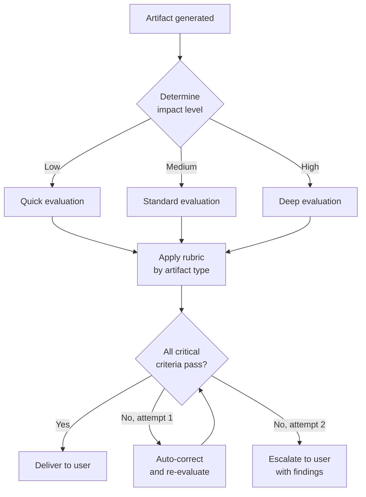
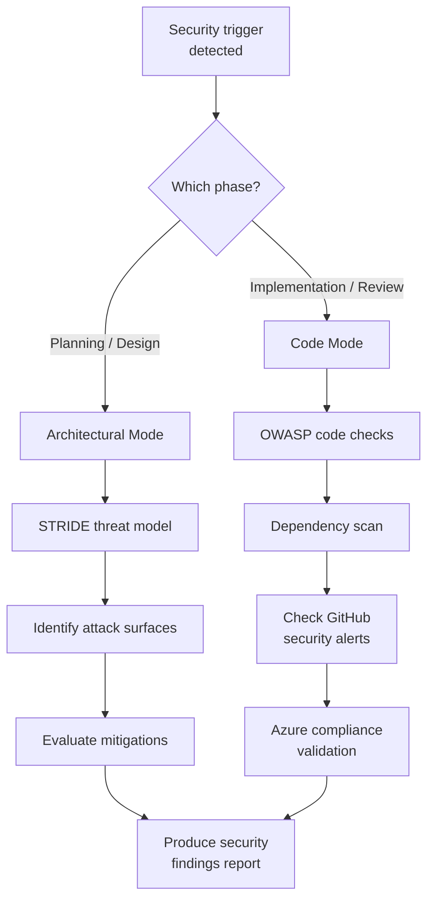

import { Aside, Badge } from '@astrojs/starlight/components';

These three skills enforce quality standards: validating artifacts at the point of creation, assessing security in two modes, and enforcing documentation formatting rules.

## quality-gate <Badge text="specify, plan, decompose, review" variant="tip" />

Validates SDD artifacts at the point of creation. Applies rubrics scaled by impact level, with a maximum of 2 correction iterations before escalating to the user.

**Evaluation levels:**
| Level | Trigger | Depth |
|-------|---------|-------|
| Quick | Minor changes, low-impact tasks | Surface-level checks |
| Standard | Normal features, medium-impact | Full rubric evaluation |
| Deep | High-impact, cross-cutting changes | Exhaustive validation with cross-references |

**Rubrics by artifact type:**
| Artifact | Key Criteria |
|----------|-------------|
| Spec | Testable requirements, prioritized stories, conformance criteria (min 3), no implementation detail |
| ADR | Ranked priorities before options, options evaluated against priorities, valid status |
| Tasks | Organized by story, correct phase ordering (Models then Services then Endpoints then Integration), no separate test tasks |
| Code | Matches spec intent, follows ADR decisions, test coverage, no regressions |

**Convergence rule:** Maximum 2 auto-correction iterations. If the artifact still fails after 2 attempts, the skill presents findings to the user with specific failure points.

<Aside>
  Quality gate does not apply to intermediate artifacts marked as draft or WIP. It activates only at the point of delivery.
</Aside>

**Activation triggers:** Spec generation, ADR creation, task decomposition, code review.

---

## security-review <Badge text="plan, implement, review" variant="tip" />

Security assessment in two modes: architectural (during design) and code (during implementation). Covers STRIDE threat modeling, OWASP guidelines, dependency scanning, and compliance checks.

**Mode detection:**
| Signal | Mode |
|--------|------|
| Spec review, ADR creation, architecture planning | Architectural |
| Code changes, PR review, implementation | Code |

**Architectural mode (STRIDE):**
- Spoofing: Authentication boundaries
- Tampering: Data integrity controls
- Repudiation: Audit trail coverage
- Information Disclosure: Data classification and encryption
- Denial of Service: Rate limiting, resource quotas
- Elevation of Privilege: Authorization model

**Code mode (OWASP + tooling):**
- Input validation and output encoding
- Authentication and session management
- Dependency vulnerability scanning
- GitHub Advanced Security alerts review
- Azure compliance baseline checks

**Security principles applied:** CIA Triad, Defense in Depth, Least Privilege, Secure by Default, Zero Trust, Shift Left.

**Activation triggers:** Authentication logic, sensitive data handling, external integrations, exposed endpoints, data persistence patterns.

---

## documentation-style <Badge text="All doc-producing agents" variant="note" />

Formatting and style rules for all markdown documentation generated in the project. Applied automatically when agents produce specs, ADRs, envisioning documents, task files, or plan files.

**Formatting rules:**
| Rule | Detail |
|------|--------|
| Spelling | No errors allowed |
| Emojis | Prohibited, including decorative Unicode |
| Separators | No hyphens between concepts; rewrite the sentence |
| Work item references | Never use `#<number>` in free text (Azure DevOps auto-links) |
| Structure | Lists and tables over long paragraphs |
| Length | Specs and ADRs should be 1-2 pages |

**Language rules:**
| Avoid | Prefer |
|-------|--------|
| "it's not just X, it's Y" | Describe directly what it is |
| "goes beyond..." | State the specific capability |
| Rhetorical questions with obvious answers | Direct assertions |
| Generic framing (works in any project) | Project-specific context |
| Passive voice | Active voice, direct sentences |

**Document structure:** Start with the most important content (conclusion, decision, summary). Use consistent hierarchical headings. Include metadata when relevant (Status, Date, Version).

<Aside>
  This skill applies to project documentation only. It does not apply to source code comments, commit messages, or work item content.
</Aside>

**Activation triggers:** Spec writing, ADR creation, envisioning documents, task decomposition files, plan files.

---

## What to Read Next

- [Architecture and Planning Skills](../../skills/architecture/) for ADR and decision-recording workflows
- [Choosing the Right Extension](../../core-components/comparison/) for when to use skills vs other mechanisms