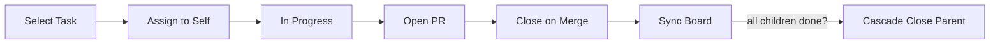
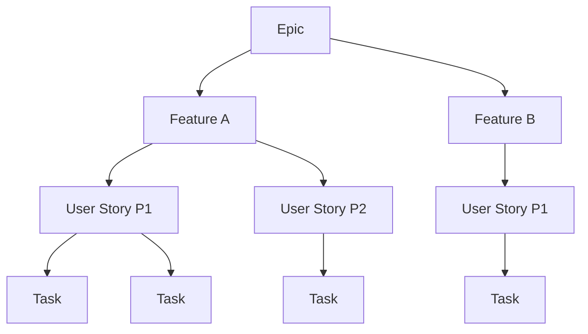

import { Tabs, TabItem, Aside, Card, CardGrid, LinkCard } from '@astrojs/starlight/components';

The board is the source of truth for **task status, assignment, and workflow state**. Design decisions and specifications remain authoritative as disk artifacts (specs, ADRs, `plan.md`). Local files (`tasks.md`, `structure.md`) are caches. Agents integrate with GitHub Issues and Azure DevOps for bidirectional work item management.

## Platform Detection

Auto-detected from git remote URL by the `detect-repo-platform.sh` sessionStart hook:

| Remote Pattern | Platform |
|---------------|----------|
| `github.com` | GitHub Issues |
| `dev.azure.com` / `visualstudio.com` | Azure DevOps |

Configuration saved to `.memory/board-config.md`.

## Work Item Types

<Tabs>
  <TabItem label="GitHub Issues">
    | Type | Label | Title Format |
    |------|-------|-------------|
    | Epic | `epic` | `[Epic] NAME` |
    | Feature | `feature` | `[Feature] NAME` |
    | User Story | `type:user-story` | `[FEATURE] DESCRIPTION` |
    | Task | `type:task` | `[FEATURE] DESCRIPTION` |
    | ADR | `type:adr` | `[ADR] DOMAIN` |
    | Tech Debt | `type:tech-debt` | `[Tech Debt] DESCRIPTION` |

    Hierarchy uses sub-issues for parent-child relationships.
  </TabItem>
  <TabItem label="Azure DevOps">
    | Type | Work Item Type |
    |------|---------------|
    | Epic | Epic |
    | Feature | Feature |
    | User Story | PBI (Scrum) / User Story (Agile) / Issue (Basic) / Requirement (CMMI) |
    | Task | Task |

    Hierarchy uses `wit_add_child_work_items` (parent-child) and `wit_work_items_link` (dependencies).
  </TabItem>
</Tabs>

## Required Tags

Always applied to every work item:
- `copilot-generated` — Marks AI-created items
- `ai-model:MODEL_NAME` — AI model traceability

Additional by type:
| Type | Additional Tags |
|------|----------------|
| User Story | `type:user-story`, `feature:NAME`, `priority:{p1,p2,p3}` |
| Task | `type:task`, `feature:NAME`, `phase:PHASE` |
| Epic | `epic` |
| Feature | `feature`, `priority:{p1,p2,p3}` |

## Workflow

<Aside>
  **One task at a time** (ADR 0009). Soft limit of 3 in-progress with a warning signal.
</Aside>

**Cascade closure**: When all children complete, the agent proposes closing the parent (user story → feature → epic).

### Work Item Hierarchy

## Autonomous Delegation

Tasks labeled `copilot-candidate` are suitable for autonomous AI execution:

| Delegable | Not Delegable |
|-----------|--------------|
| CRUD endpoints per spec | Initial project setup |
| Validations per spec | External integrations |
| Service following contract | Public API changes |
| Unit tests following pattern | Multi-module refactoring |

## Related

<CardGrid>
  <LinkCard title="Agents: Lifecycle" href="/devsquad-copilot/agents/lifecycle/" description="The agents that create and manage work items (kickoff, decompose, implement)." />
  <LinkCard title="Core Components: Hooks" href="/devsquad-copilot/core-components/hooks/" description="Automatic tag validation and platform detection hooks." />
  <LinkCard title="Team Coordination" href="/devsquad-copilot/guardrails/team-coordination/" description="How artifacts and board state coordinate parallel developer sessions." />
</CardGrid>

---

## What to Read Next

- [Team Coordination](/devsquad-copilot/guardrails/team-coordination/) for multi-developer workflows
- [Context Management](/devsquad-copilot/core-components/context-management/) for how artifacts and board state interact
