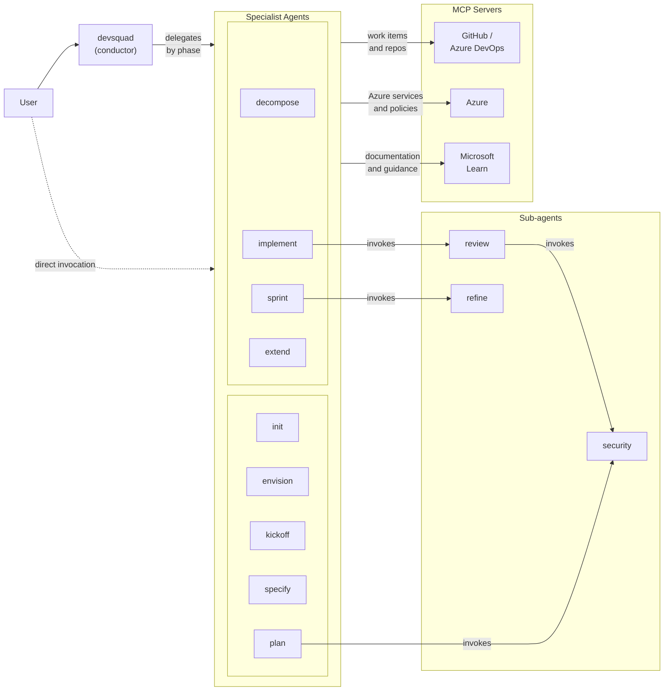
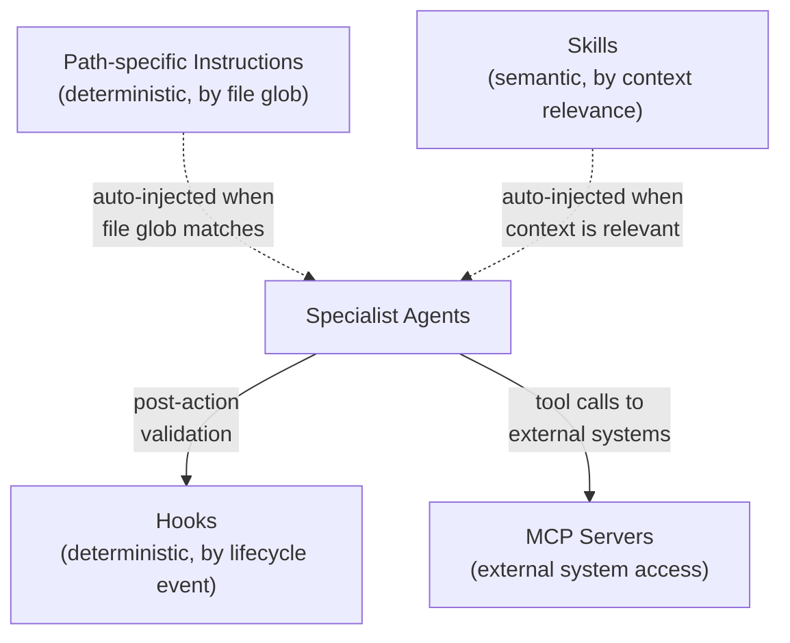
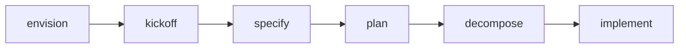
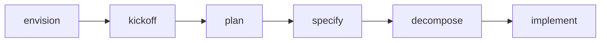
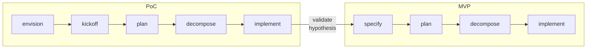
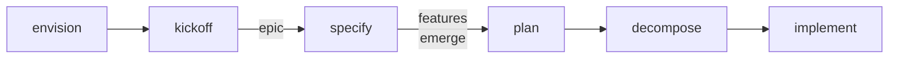
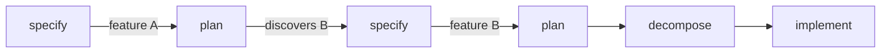
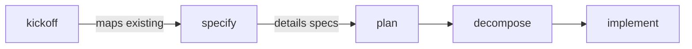

# Architecture

## Design Principles

- **Flexibility of use**: the user chooses how to interact, either through a single agent as a guide across all phases, or by directly selecting the desired specialist agent. Both modes offer a consistent experience, balancing productivity with learning.
- **Socratic by design**: agents ask before assuming, verify understanding, and explain principles. Every interaction is an opportunity for knowledge transfer.
- **Artifacts as source of truth**: Specs, ADRs, and contracts persisted in files are the reference, not the volatile session context.
- **Language-agnostic**: software quality and engineering principles are universal; the framework does not prescribe a stack. Users incorporate project-specific context via [path-specific instructions, skills, and hooks](./extensibility.md).
- **AI model-agnostic**: the framework does not prescribe which models to use. Each organization applies available models according to its policies, constraints, and needs.
- **Human in control**: no medium or high impact decision is executed without explicit user confirmation.

## Architecture Decisions

| ADR | Decision | Summary |
|-----|----------|---------|
| [0001](./decisions/0001-agent-orchestration.md) | Agent Orchestration | Conductor (Mediated Coordinator-Worker) with dual-mode, instead of classic orchestrator or independent agents |
| [0002](./decisions/0002-conductor-sub-agent-communication.md) | Communication between Conductor and Sub-agents | Prefix-based protocol with structured actions and dual-mode |
| [0003](./decisions/0003-context-management.md) | Context Management across Phases | Artifacts on disk as source of truth + Handoff Envelope for explicit transfer |
| [0004](./decisions/0004-activation-model.md) | Component Activation Model | Instructions (deterministic), skills (semantic), and agents (explicit), each optimized for its scenario |
| [0005](./decisions/0005-socratic-ai.md) | Socratic AI | Adaptive Socratic approach by impact, instead of silent execution or post-execution explanation |
| [0006](./decisions/0006-estimation-and-risk-management.md) | Estimation and Risk Management | Analysis by unknown work and scenarios, instead of story points or hours |
| [0007](./decisions/0007-work-decomposition.md) | Work Decomposition | Mandatory phases (Setup, Foundational, Stories, Polish) with grouping by user story |
| [0008](./decisions/0008-testing-strategy-in-decomposition.md) | Testing Strategy in Decomposition | Tests integrated as acceptance criteria, without separate tasks |
| [0009](./decisions/0009-developer-capacity.md) | Developer Capacity | One task at a time with soft concurrency limit |
| [0010](./decisions/0010-agent-tool-extension.md) | Agent Tool Extension | Agent overlay generation for consumer tool injection [Preview] |

## Architecture Diagrams

### Agent Interaction

The framework follows a [conductor pattern](./decisions/0001-agent-orchestration.md): the user interacts with a central conductor that delegates to specialist agents by phase. Agents can also be invoked directly. Sub-agents are invoked autonomously by other agents for security assessment, code review, and backlog health analysis. All agents are prefixed with `devsquad.` (e.g., `init` in the diagram represents `devsquad.init`).

Solid arrows: explicit invocation or tool calls. Dashed arrows: optional path.

### Extension Mechanisms

Four mechanisms extend agent capabilities without modifying agent code. Each has a different [activation model](./decisions/0004-activation-model.md):

Dashed arrows: auto-activated (agent does not explicitly request). Solid arrows: agent-initiated.

### Component Catalog

- [Specialist Agents and Sub-agents](./core-components/custom-agents.md)
- [Skills](./core-components/skills.md)
- [Path-specific Instructions](./core-components/instructions.md)
- [Hooks](./core-components/hooks.md)
- [Remote MCP Servers](./core-components/mcp-servers.md)
- [Context Management across Phases](./core-components/context-management.md)
- [Extensibility](./extensibility.md)

## Usage Scenarios

### Feature-first

When use cases and feature scope are well defined during envisioning sessions.

> Example: E-commerce system with cart, checkout, and payment.

Technical decisions before features. Common in modernizations and integrations.

- `kickoff` generates only the epic
- `plan` generates ADRs, and `specify` breaks them into features

> Example: Monolith to microservices migration. Define decomposition strategy before features.

### Validation-first

Hypothesis to validate before committing to product scope. The full flow (envision to implement) runs twice: first for the PoC, then for the MVP informed by the results.

- `kickoff` structures the project as a POC/Experiment
- `plan` generates exploratory technical artifacts (contracts, data-model, ADRs as Proposed)
- After implementing and validating the PoC, the cycle restarts with `specify` to define product requirements

**PoC to MVP Transition**: PoC artifacts (ADRs, contracts, data-model) serve as input for the specification phase. ADRs validated during the PoC can be accepted directly. Technical artifacts are refined (not rewritten from scratch) based on learnings.

### Emergent scope

Clear vision, undefined scope. Features emerge during specification while exploring solutions.

- `kickoff` generates only the epic
- `specify` is used for brainstorming/exploring features

> Example: Client with a product idea without a defined MVP.

### Iterative

Continuous discovery. Each feature reveals the need for others.

> Example: Planning "authentication" reveals the need for "user management" and "auditing".

### Board-first

Existing project with a disorganized backlog. Focus on mapping structure and filling gaps.

> Example: Team inherited a project with N work items without hierarchy. Kickoff maps which are epics/features, specify creates specs for items without documentation.

## Known Limitations

### Change Propagation

The current flow supports incremental updates to specs, ADRs, and envisioning, but **does not automatically propagate** the impact of those changes to existing work items.

| Scenario | Current Behavior | Ideal |
|----------|------------------|-------|
| Spec updated | Existing tasks are not notified | Mark impacted tasks as `needs-review` |
| ADR superseded | Tasks that depend on the old decision continue | Identify and alert about inconsistency |
| Feature canceled | Work items become orphaned | Close or archive automatically |
| Re-prioritization | Requires manual board update | Assisted re-prioritization mode |

**Mitigation**: `/devsquad.refine` detects specs updated after task creation and superseded ADRs with active tasks. Use it periodically to identify inconsistencies.

### Centralized Board

Initial tests assume that a project would have the **backlog centralized in a single board** (GitHub Issues or Azure DevOps).

There is no integration with:
- Multiple boards or projects
- Context tools such as [Work IQ MCP](https://developer.microsoft.com/blog/bringing-work-context-to-your-code-in-github-copilot)
- Cross-platform synchronization (e.g., GitHub <-> Azure DevOps)

**Workaround**: Use a single board as source of truth and synchronize manually if needed.

## Versioning and Releases

The framework uses [Semantic Versioning](https://semver.org/) with git tags in the format `vMAJOR.MINOR.PATCH`.

### When to increment each level

| Level | When | Examples |
|-------|------|----------|
| **PATCH** (v0.1.**1**) | Fixes that do not change behavior | Fix in agent prompt, typo in instruction, wording adjustment |
| **MINOR** (v0.**2**.0) | New backward-compatible features | New agent, new skill, new template, guideline change |
| **MAJOR** (v**1**.0.0) | Breaking changes in structure or contracts | Rename agents, change directory structure, remove skill |
