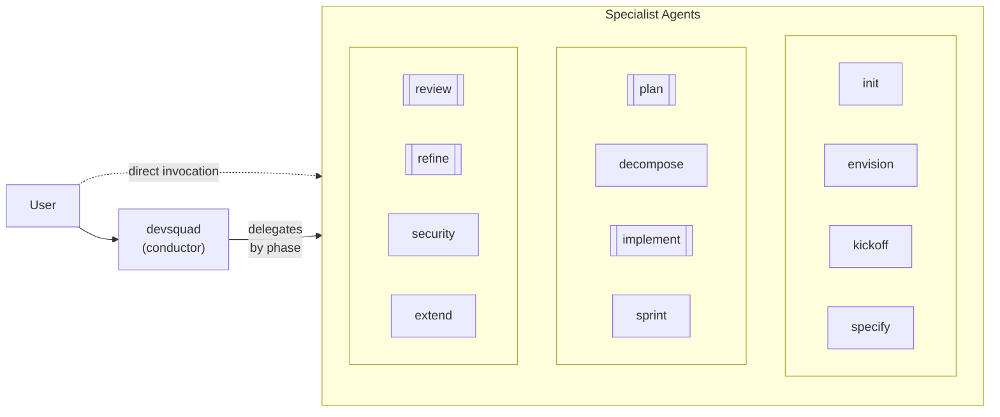

import { CardGrid, LinkCard, Aside } from '@astrojs/starlight/components';

This page maps every agent in the framework: what it does, when it activates, and how agents collaborate. Use the table below to find the right agent for your task.

The DevSquad framework exposes 13 user-visible agents: the `devsquad` conductor plus 12 specialist agents. Complex specialists can also act as coordinators and delegate to hidden worker sub-agents with isolated context.

## Agent Flow

<Aside type="note">
  Coordinator agents use double borders in the diagram. Their worker sub-agents are internal and require `chat.subagents.allowInvocationsFromSubagents` when running in VS Code.
</Aside>

## Agent Summary

| Agent | Purpose | Produces | Next |
|-------|---------|----------|------|
| `devsquad` | Conductor | Context and phase detection | Any sub-agent |
| `devsquad.init` | Initialize project | Framework files and templates | envision |
| `devsquad.envision` | Capture strategic vision | `docs/envisioning/README.md` | kickoff |
| `devsquad.kickoff` | Structure project hierarchy | Board structure + `structure.md` | specify or plan |
| `devsquad.specify` | Write feature specs | `docs/features/*/spec.md` | plan or decompose |
| `devsquad.plan` | Technical planning | ADRs + `plan.md` | decompose or security |
| `devsquad.decompose` | Decompose to tasks | `tasks.md` + work items | implement |
| `devsquad.implement` | Execute code | Source code + PR | review |
| `devsquad.review` | Validate implementation | Review log with findings | implement or plan |
| `devsquad.security` | Security assessment | Security report | implement or review |
| `devsquad.sprint` | Sprint planning | `sprint-N.md` + scope options | plan or decompose |
| `devsquad.refine` | Backlog health + mid-flight spec amendment | Analysis report, fixes, or scoped spec/ADR amendment | specify, kickoff, or back to implement |
| `devsquad.extend` | Framework extension | Custom components | varies |

## Coordinator Agents

| Coordinator | Worker delegation |
|-------------|-------------------|
| `devsquad.plan` | Loads context and architecture analysis in workers before design artifact authoring. Can invoke `devsquad.security` as a nested specialist. |
| `devsquad.implement` | Delegates validation, coding execution, verification, and finalization to focused workers. Invokes `devsquad.review` for nested validation. |
| `devsquad.review` | Runs parallel workers for spec, ADR, code, security, and tests checks before merging findings. |
| `devsquad.refine` | Splits artifact checks and backlog health analysis into parallel workers. |

## By Category

<CardGrid>
  <LinkCard title="Conductor" href="../agents/conductor/" description="The central orchestrator that detects intent and delegates to specialists." />
  <LinkCard title="Lifecycle Agents" href="../agents/lifecycle/" description="init, envision, kickoff, specify, plan, decompose, implement: the main delivery pipeline." />
  <LinkCard title="Support Agents" href="../agents/support/" description="review, security, sprint, refine, extend: quality, planning, and extensibility." />
</CardGrid>

---

## What to Read Next

- [Conductor](../../agents/conductor/) for the main entry point
- [Getting Started](../../getting-started/) to install and run your first workflow
