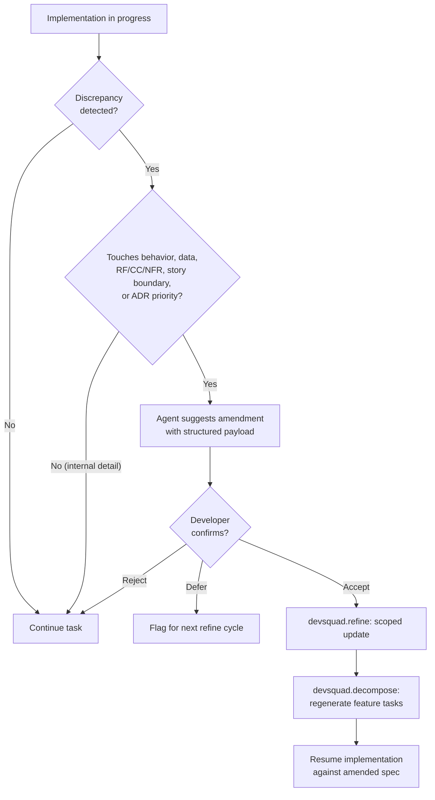

import { Card, CardGrid, Aside, Steps } from '@astrojs/starlight/components';

The best ideas often surface during the work itself. A spec written before implementation is a hypothesis about what to build; implementation is where that hypothesis meets reality. When the two disagree, the framework treats it as a first-class event, not a deviation to hide.

> Specs are living artifacts. The framework has a named seam for amending them mid-flight.

## Why This Matters

A *slice*, in this framework, is a unit of work with an end-to-end conformance case, observable behavior for someone outside the implementing team, and coverage across every layer it touches (data, logic, surface). Amendment is how a slice stays accurate when implementation reveals the spec was wrong.

Three failure modes appear in spec-driven development when implementation-time discoveries have no defined path:

<CardGrid>
  <Card title="Silent Deviation" icon="warning">
    Code drifts from the spec, the spec stops describing what the system actually does, downstream agents and reviewers lose their reference point.
  </Card>
  <Card title="Big-Design-Up-Front Pressure" icon="warning">
    Teams over-invest in the initial spec to avoid changing it later, producing the waterfall posture spec-driven development is meant to avoid.
  </Card>
  <Card title="Lost Learning" icon="warning">
    The model shift that prompted the change is never written down, so the same confusion resurfaces on the next feature.
  </Card>
</CardGrid>

Spec amendment is the framework's answer to all three.

## When to Amend

The implement agent (via the `validate` and `execute` workers) and the developer watch for these signals during a task. The decision rule is **artifact-based**, not a slogan:

**Raise amendment when the discovery would change any of:**

| Change touches... | Example |
|---|---|
| User-visible behavior or acceptance outcome | New required field blocks an acceptance criterion as written |
| Persisted data shape or lifecycle | A value becomes an entity; a field becomes a relationship |
| RF-XXX, CC-XXX, or NFR text | A stated threshold or success condition is not achievable as written |
| User story boundary or board hierarchy | One story is actually two, or two collapse into one |
| Ranked ADR priority ordering | A ranked priority turns out to rank below another in practice |

**Do NOT raise amendment for changes that only touch:**

- Algorithm or library choice with no observable contract change
- Internal structure, file layout, or refactor
- Naming, comments, or code style
- Non-observable performance tuning within stated NFRs

**Ambiguous categories** (validation rules, error handling, retries, idempotency, caching, pagination, authorization, fallback behavior): raise amendment only when the behavior becomes externally observable, contractually specified, or compliance-relevant. Internal-only implementations of these stay in code and tests.

<Aside type="note">
  The rule protects against two failure modes: general principles ("changes what, not how") that are too vague to apply consistently, and over-frequent drift raising that trains developers to ignore the seam. When in doubt, check whether the change would alter any artifact a downstream agent or reviewer reads.
</Aside>

## The Amendment Loop

<Steps>

1. **Implement agent detects drift.**

   Either `devsquad.implement.validate` (pre-flight) or `devsquad.implement.execute` (mid-execution) compares the emerging model against the current spec and ADRs. If the discrepancy meets the amendment criteria, the worker returns a `spec-drift` flag with a structured payload: affected artifact and section, original statement, observed reality, impacted RF/CC/story IDs, recommended scope, and confidence. The coordinator pauses the task instead of proceeding.

2. **Developer confirms the model shift.**

   The agent presents the structured payload to the developer: what the spec says, what the code is telling us, what section would be amended. The developer confirms, rejects, or defers. Amendments are suggested, never silently applied.

3. **Lightweight amendment is recorded.**

   The `devsquad.refine` agent is invoked mid-flight with the `[AMEND]` prefix (not only between sprints) to update the spec or ADR. The amendment is scoped: only the affected user story, conformance case, or ADR section is touched. The reasoning log captures *what changed and why*.

4. **Re-decomposition is explicitly triggered.**

   After the amendment, the coordinator invokes `devsquad.decompose` to regenerate tasks so they reflect the amended spec. Developers should expect task IDs and board items to churn; v1 does not yet support section-scoped re-decomposition with stable IDs (see Known Limitations).

5. **Implementation resumes.**

   The current task is restarted or continued against the amended spec. The review agent, running in an independent context, later validates the implementation against the *amended* artifacts, not the original.

</Steps>

## Decision Flow

## Worked Example

Onboarding flow for a gift-tracking app. Original P1 spec: users enter a recipient as a free-text name when creating an occasion.

During implementation of the occasion form, it becomes clear that recipients have multiple occasions, gift history across time, and relationships that outlive any single occasion. Modeling them as strings forces duplication and blocks the P2 "gift history" story.

Amendment path:

1. The implement agent flags drift: the recipient is behaving like an entity, not a value. The payload names the impacted user story, the CC-XXX cases for "create occasion", and the persistence ADR.
2. The developer confirms; the change touches persisted data shape and a user story boundary, not an internal detail.
3. `devsquad.refine` amends the spec: recipients become a first-class entity with their own user story. The affected conformance cases for "create occasion" are rewritten to reference a recipient by ID. One ADR on persistence gains a new ranked priority: "support recipient-first queries".
4. `devsquad.decompose` regenerates the task list for the feature so it reflects the amended spec. Task IDs for the feature change; the developer re-syncs the board.
5. Implementation resumes against the amended spec.

The alternative is silent deviation: code ships with a recipient entity while the spec still says string, and the next agent or developer starts from a stale map.

## What This Is Not

- **It is not a rewrite trigger.** Amendment is scoped to the affected section. A discovery that invalidates the whole feature is not an amendment; it is a new envisioning cycle. The agent escalates instead of amending when any of the following hold: more than one priority story is affected, a success metric or headline NFR changes, the majority of feature tasks would be invalidated, epic boundaries shift, more than one ADR or `plan.md` needs rewriting, or the discovery contradicts the envisioning document rather than the spec.
- **It is not a way to skip planning.** Plan-level decisions that would produce an ADR still produce an ADR. Amendment speeds the loop, not the rigor.
- **It is not automatic.** The developer confirms every amendment. Agents flag and suggest; they do not silently rewrite specs.
- **It is not unbounded.** After two high-impact amendments on the same task or slice, the agent pauses instead of applying a third. Three model shifts in the same slice means the problem is upstream of the amendment seam, not downstream.

## Propagation Checklist (High-Impact Amendments)

A high-impact amendment often invalidates artifacts beyond the spec and ADR it directly edits. The refine agent runs a propagation checklist on every high-impact amendment and returns the results to the implement coordinator. The coordinator blocks resume until each flagged artifact is either updated (via `devsquad.plan`) or explicitly waived.

| Artifact | What to check |
|---|---|
| `plan.md` | Architecture sketch, component boundaries, chosen approach |
| `data-model.md` | Entity, relationship, or persistence decisions touched by the amendment |
| `contracts/` | API contracts, event schemas, or interface definitions impacted |
| `research.md` | Research findings that underpinned the now-amended decision |
| Related ADRs | Ranked priorities that shift as a consequence of the amended ADR |

The refine agent does not edit these artifacts in amendment mode. It flags them; the follow-up pass happens in `devsquad.plan` with its own classification and ceremony.

## Known Limitations (v1)

The amendment seam is intentionally minimal in the first iteration. These gaps are tracked and will close incrementally.

- **Re-decomposition is not scope-aware yet.** After a successful amendment, `devsquad.decompose` regenerates tasks for the whole feature, not only the amended section. Developers should expect task IDs and board items to churn until stable task IDs with supersede semantics land.
- **Design artifacts beyond spec and ADR are not auto-propagated.** The propagation checklist flags `plan.md`, `data-model.md`, `contracts/`, and `research.md` when they exist, but the framework does not yet update them automatically. A manual follow-up `devsquad.plan` pass is required before implementation resumes.
- **Multi-developer concurrency is not guarded.** If another developer is mid-implementation on a task derived from the amended section, their branch may become semantically stale without a merge conflict. Manual coordination is the current mitigation.
- **No strict mode for regulated contexts.** The default is suggest-only with confirm, reject, or defer. Reject and defer allow continuation under a known-stale spec; teams with compliance or audit constraints should configure their own gate until a strict mode ships.
- **Structured drift payload is advisory.** The payload fields (artifact, section, impacted IDs, confidence) are produced by `devsquad.implement.validate` and `devsquad.implement.execute`; they are not yet enforced as a schema. Malformed payloads fall back to prose.

## Interaction with Impact Classification

Amendments follow the same impact classification as any other change:

| Amendment type | Impact | Ceremony |
|---|---|---|
| Wording clarification, terminology fix | Low | Direct update, no ADR |
| New/changed conformance case within a story | Medium | Scoped refine, developer confirms |
| User story boundary change, new entity, NFR change | High | Amendment plus ADR update, explicit approval |

## Spec Evolution Log

Every feature and migration spec carries a `Spec Evolution Log` section. The log is the durable record of what changed about the spec and why. Without it, the third reader of a spec cannot tell which clauses are original intent and which were amendments responding to discovered reality.

The log is a table with one row per version:

| Column | Content |
|---|---|
| Version | Semantic version of the spec (`1.0` at creation, increments per amendment) |
| Date | ISO date of the change |
| Change summary | One-sentence description of what changed |
| Trigger | Why the change happened, drawn from the enumerated values below |
| Author | Who authored the change |

Valid trigger values:

| Trigger | When to use |
|---|---|
| `new work` | Adding scope, requirements, or scenarios in response to product direction |
| `drift` | Reconciling the spec with implementation reality discovered during the work |
| `external constraint` | Compliance, vendor change, platform deprecation, or other outside force |
| `failure (spec)` | Amendment closes a case the spec was silent on, or disambiguates a clause that admitted two readings |
| `failure (validation)` | Amendment adds a conformance case, test, or rubric criterion the validation surface missed |
| `failure (agent)` | Amendment fixes a misaligned agent body, composition declaration, or tool config |
| `other (<short reason>)` | Transitional escape hatch when none of the above fit. Raises a quality alert prompting maintainers to consider a new category. |

The three `failure (<category>)` triggers tie the log to the framework's upstream-fix discipline (described in the next section).

## Failure-Driven Amendment

Not every amendment is product-direction or implementation-discovery. Some amendments are **failure-driven**: an agent did the wrong thing, and the durable fix is to amend the upstream artifact that owns the rule the agent broke. Prompt patches that mask the symptom without reconciling the upstream artifact are forbidden; they accumulate and degrade the framework.

When an agent-originated failure surfaces, classify it into one of three categories and route the fix to the named upstream artifact:

| Category | When | Upstream artifact |
|---|---|---|
| `failure (spec)` | Agent did the wrong thing because the spec was silent, ambiguous, or did not bound scope correctly | `spec.md`, ADR, glossary, or Non-Scope section |
| `failure (validation)` | The spec required the right behavior but conformance criteria, tests, or the quality-gate rubric did not catch the miss | Conformance criteria, tests, or rubric file |
| `failure (agent)` | Agent body, composition declaration, tool config, or coordination contract was misaligned with the spec | Agent file (body or `agents:` frontmatter), composition declaration, or handoff |

Selection test: **Was the expected behavior already required by a normative obligation in the artifact stack?**

- If **no**, the failure is `spec`. The validation surface could not catch what the spec did not require.
- If **yes** but the validation surface did not check it, the failure is `validation`.
- If **yes** and the validation surface would have caught it but the agent skipped a step, acted out of role, or invoked the wrong sub-agent, the failure is `agent`.

After amending the upstream artifact, record the change in the Spec Evolution Log with the matching `failure (<category>)` value in the Trigger column. The category name is the durable signal that the framework learned from a failure rather than from new product direction.

Worked examples and category-selection guidance live in the `failure-taxonomy.md` reference file in the `debugging-recovery` skill.

## Related

- [Impact Classification](../../concepts/impact-classification/): amendment ceremony scales with risk in the same way task ceremony does.
- [Comprehension Checkpoints](../../concepts/comprehension-checkpoints/): the amendment confirmation is itself a checkpoint, forcing the developer to engage with the model shift rather than rubber-stamp it.
- [Reasoning and Handoff](../../concepts/reasoning-and-handoff/): amendments produce a reasoning log entry that downstream agents rely on.

---
## What to Read Next

- [Impact Classification](../../concepts/impact-classification/) for how amendment ceremony scales with risk
- [Team Coordination](../../guardrails/team-coordination/) for how amendments propagate across developers and boards
