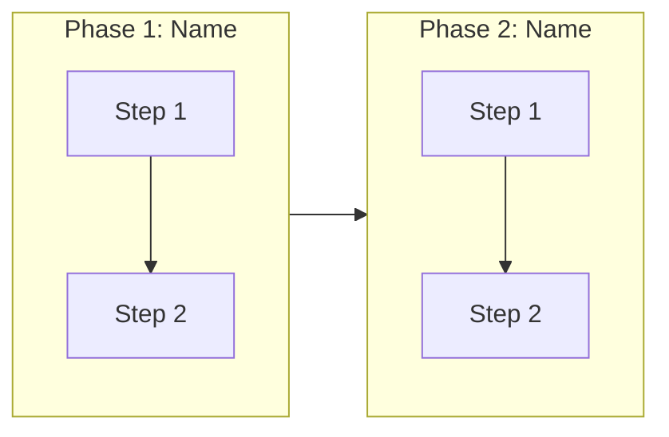

# Envisioning: [Project/Product Name]

> **Status:** [In Discovery / In Validation / Approved]  
> **Last updated:** [YYYY-MM-DD]  
> **Version:** 1.0

---

## 1. Client Context

### 1.1 Direct Client

The team or organization we are directly serving (our client).

| Aspect | Information |
|--------|-------------|
| **Company/Team** | [Name of the company/organization/team that contracted or requested the project] |
| **Domain** | [E.g.: fintech, e-commerce, healthcare, logistics, government] |
| **Team scale** | [Small: <10 devs / Medium: 10-50 devs / Large: 50+ devs] |
| **Channels** | [Web, mobile, API, etc.] |

### 1.2 End Customer

The user or consumer served by the direct client.

| Aspect | Information |
|--------|-------------|
| **Profile** | [Who are the end users of the product/service] |
| **Volume** | [Number of users, transactions, or other relevant metric] |
| **Usage context** | [How and where the end customer interacts with the product] |

### 1.3 Additional Context

[Describe existing products/systems being consolidated or replaced, if applicable]

---

## 2. Project Focus

### Prioritized Problem

[Describe the main problem this project solves]

| Aspect | Decision |
|--------|----------|
| **Chosen focus** | [What will be solved] |
| **Justification** | [Why this focus was chosen] |
| **Initial scope** | [What is included] |
| **Out of initial scope** | [What was excluded and why] |

---

## 3. Target Users

### 3.1 [User Profile Name 1]

[Profile description]

**Main needs:**
- [Need 1]
- [Need 2]
- [Need 3]

### 3.2 [User Profile Name 2] (if applicable)

[Profile description]

**Main needs:**
- [Need 1]
- [Need 2]

---

## 4. Diagnosis: Known Pain Points

### 4.1 Business Pain Points

| Problem | Impact | Source |
|---------|--------|--------|
| [Pain 1] | [Cost, revenue loss, churn, etc.] | [Data source] |
| [Pain 2] | [Measurable impact] | [Data source] |
| [Pain 3] | [Measurable impact] | [Data source] |

**Main impact area:**
- [ ] End user experience
- [ ] Internal operations
- [ ] Costs/efficiency
- [ ] Growth/scalability
- [ ] Multiple areas

### 4.2 Technical Pain Points

Categories: Fragmentation, Scalability, Security, Observability, Agility, Integration, Performance, Maintainability

| Category | Problem | Impact |
|----------|---------|--------|
| [Category] | [Description] | [Impact on system/business] |
| [Category] | [Description] | [Impact on system/business] |
| [Category] | [Description] | [Impact on system/business] |

---

## 5. User Journey

[Mapping of the main journey phases]

### 5.1 Phase: [Phase Name]

| Moment | Channel | Status |
|--------|---------|--------|
| [Moment 1] | [Channel] | [OK / CRITICAL / TO MAP] |
| [Moment 2] | [Channel] | [Status] |

---

## 6. Strategic Objectives

### Business Objective

[What does the business want to achieve? Focus on measurable outcomes.]

### Technical Objective

[How will technology enable the business objective?]

### Success KPIs

| KPI | Target | Current Baseline |
|-----|--------|------------------|
| [Metric 1] | [Target value] | [Current value if known] |
| [Metric 2] | [Target value] | [Current value if known] |
| [Metric 3] | [Target value] | [Current value if known] |

---

## 7. Constraints and Considerations

### Critical Constraints

[Regulatory, budget, deadline, mandatory technologies, compatibility]

- [Constraint 1]
- [Constraint 2]

### System Dependencies

[Legacy systems, external APIs, third-party integrations]

- [Dependency 1]
- [Dependency 2]

### Non-Negotiable Principles

[E.g.: API-first, Mobile-first, Zero downtime]

- [Principle 1]
- [Principle 2]

---

## 8. Prioritization Hypotheses

| Priority | Area | Justification |
|----------|------|---------------|
| **P0** | [Critical area] | [Why it is top priority] |
| **P1** | [Important area] | [Justification] |
| **P2** | [Secondary area] | [Justification] |

---

## 9. Outstanding Items

### Decisions Awaiting Validation

| Decision | Status | Owner |
|----------|--------|-------|
| [Decision 1] | To be defined | [Name] |
| [Decision 2] | To be defined | [Name] |

### Missing Information

| Item | Impact |
|------|--------|
| [Information 1] | [Why it is needed] |
| [Information 2] | [Why it is needed] |

### Hypotheses to Validate

| Hypothesis | Required Validation |
|------------|---------------------|
| [Hypothesis 1] | [How to validate] |
| [Hypothesis 2] | [How to validate] |

---

## 10. Next Steps

- [ ] [Action 1] (Owner, Deadline)
- [ ] [Action 2] (Owner, Deadline)
- [ ] [Action 3] (Owner, Deadline)

### Project Team

**Client:** [Names and roles]

**Technical team:** [Names and roles]

---

## References

- [Link to relevant document 1]
- [Link to relevant document 2]

---

## Update History

| Date | Author | Change |
|------|--------|--------|
| [YYYY-MM-DD] | [Name] | Document creation |
